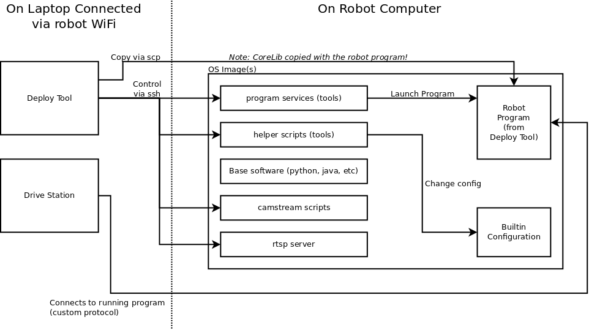

## GitHub

The source code for all components is located on the [ArPiRobot GitHub](https://github.com/orgs/ArPiRobot/repositories). There is also a [project board](https://github.com/orgs/ArPiRobot/projects/2).

Generally, the most up to date documentation on building or using a specific component is located in the `README.md` file in that component's repository. Information in this section of the docs is intended to be supplemental.

## Components

There are various components of the framework. Some are used on the development PC, others are included in the OS image and are used on the robot.

**Development PC Components:**

- [Drive Station](https://github.com/ArPiRobot/ArPiRobot-DriveStation): Program that runs on the PC and connects to a program running on the robot over network. Uses custom communication protocol to enable / disable the robot, implement a network table (key / value pairs shared between robot and drive station), retrieve logs, and send controller (gamepad) data to the robot.  
- [Mobile Drive Station](https://github.com/orgs/ArPiRobot/repositories): Drive station that runs on an android phone or tablet. Uses virtual (on-screen) gamepad to control the robot.  
- [Deploy Tool](https://github.com/ArPiRobot/ArPiRobot-DeployTool): Program that runs on the PC. Primarily used to deploy a program to the robot. Also implements various features to configure and monitor the robot. Additionally acts as a front-end for camera stream components.  
- [Visual Studio Code Extension](https://github.com/ArPiRobot/ArPiRobot-VSCodeExtension): Extension for Visual Studio Code that can create ArPiRobot projects from a template.  
- [C++ Toolchains](https://github.com/ArPiRobot/ArPiRobot-Toolchain): GNU cross compiler toolchains capable of building C / C++ programs to run on the robot. Prebuilt toolchains are provided for each officially supported target architecture. Builds to run on Windows (x86_64), macOS (x86_64), and Linux (x86_64) are provided.  

**Robot Components:**

- [CoreLib](https://github.com/ArPiRobot/ArPiRobot-CoreLib): The core library used by robot programs. Implements: custom network protocol for use with drive station, logging, code to control various devices, multiple I/O backend libraries, a base class for robots, a scheduler driven action system, and an interface to an Arduino running the official Arduino Firmware. *Note that while this is used on the robot, it is not included with OS images. Update packages for the CoreLib are installed by the deploy tool on the development PC. The CoreLib is deployed with the robot program. Thus, the CoreLib version used will be the version installed on the development PC.*
- [ArPiRobot-Tools](https://github.com/ArPiRobot/ArPiRobot-Tools): Various scripts used by the deploy tool and services used to manage the robot program. Included with the OS image.  
- [Arduino Firmware](https://github.com/ArPiRobot/ArPiRobot-ArduinoFirmware): Runs on an Arduino connected to the robot's main computer. Implements various device drivers to control many types of sensors. Configured by the robot program.  
- [Camera Streaming](https://github.com/ArPiRobot/ArPiRobot-CameraStreaming): Camera streaming services and scripts. Focused on realtime, low-latency streams for use on the robot. Included with the OS image.  
- [Image Scripts](https://github.com/ArPiRobot/ArPiRobot-ImageScripts): Used to create OS images for all officially supported boards.  

**Other Components:**

- [CAD Models](https://github.com/ArPiRobot/ArPiRobot-CADModels): Models of example robot builds and custom parts.  
- [Examples](https://github.com/ArPiRobot/ArPiRobot-Examples): Example robot programs.  
