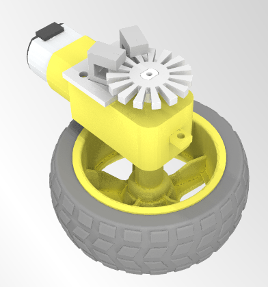
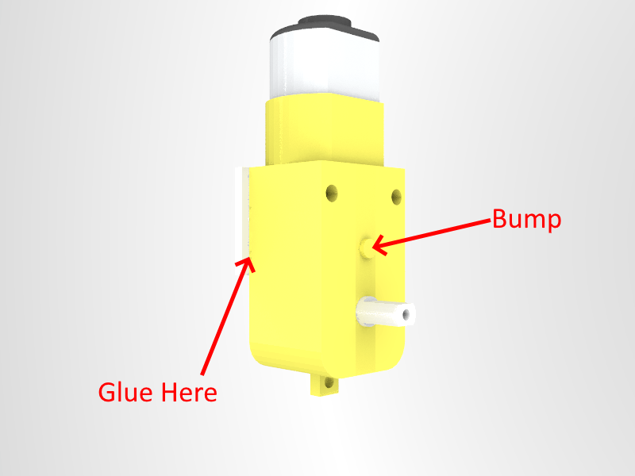
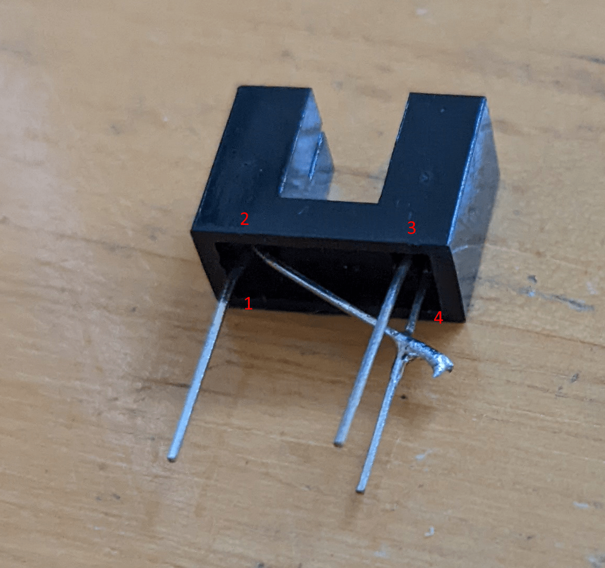
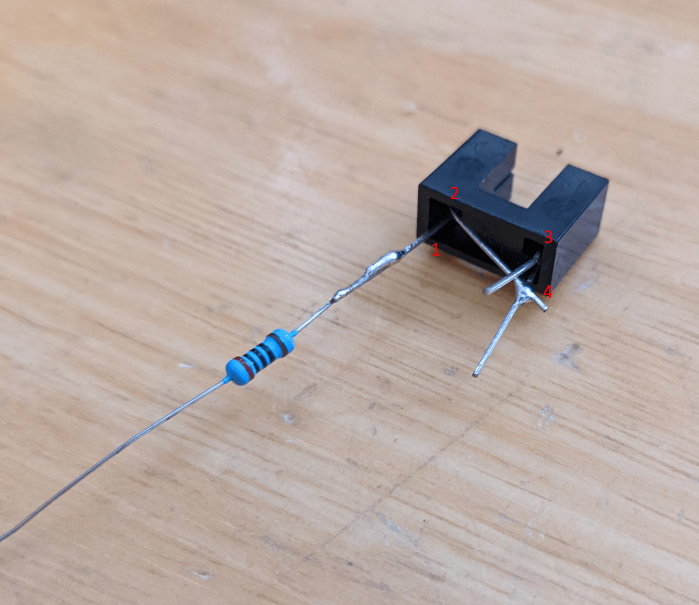
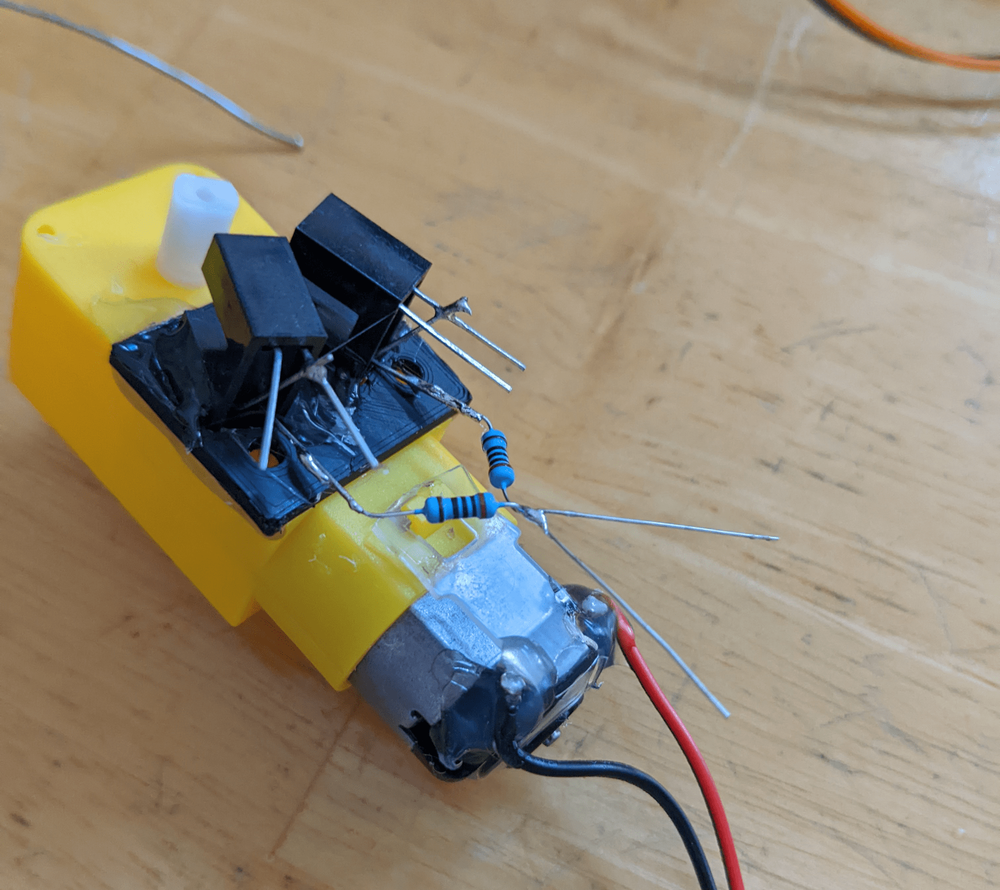
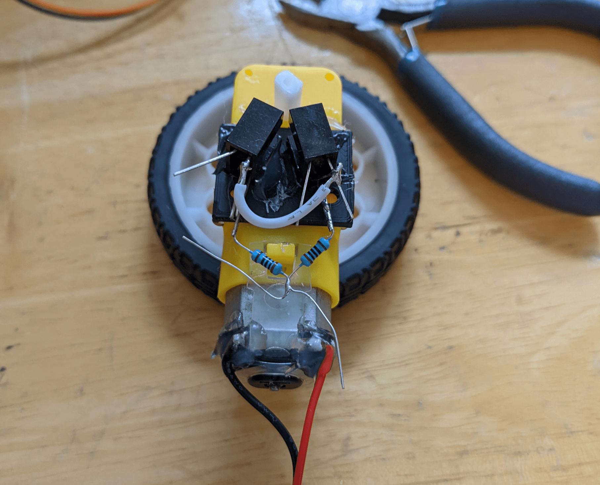
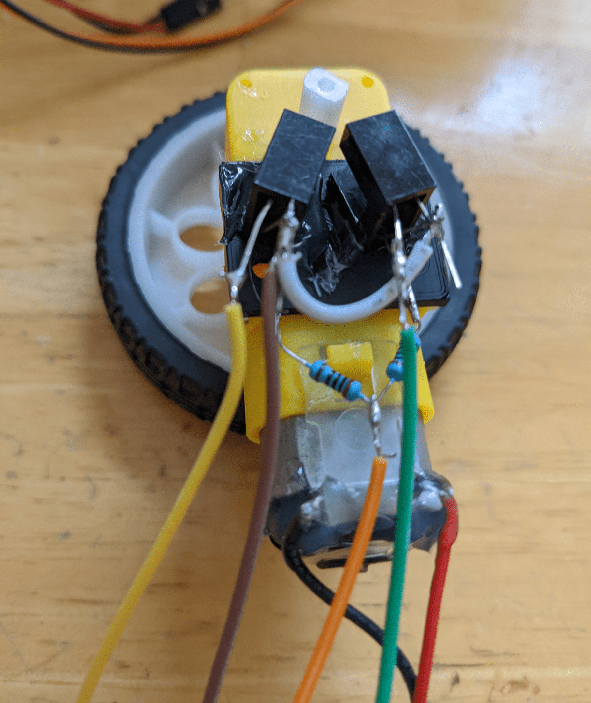
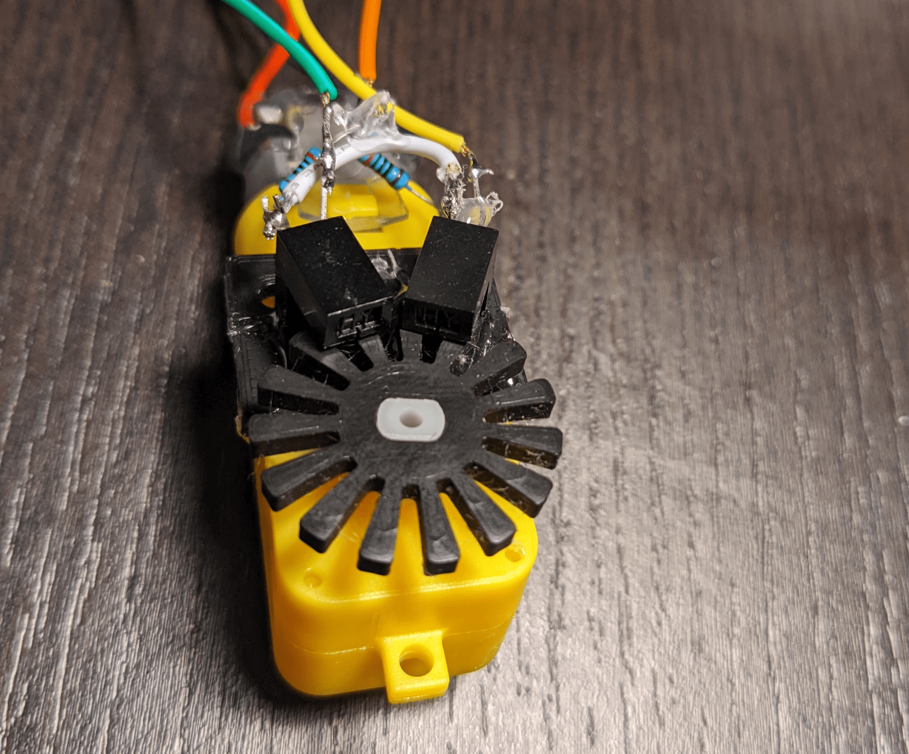
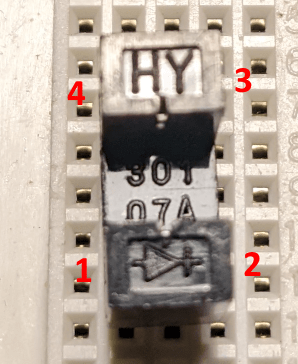
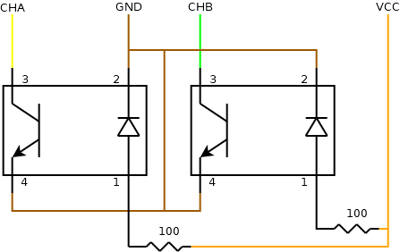

Custom designed optical quadrature encoder for "TT Motors" (yellow gearmotors). Designed to be a low cost way to add a quadrature encoder to low cost motors. While some of these motors are sold with an included hall effect encoder, these are hard to find and often quite expensive.

This is an optical encoder using two photo interrupters. An alignment plate is used to position the interrupters such that they generate out of phase signals using the custom encoder disk (thus creating a quadrature encoder).

## Version 1

Version 1 uses HY301-07A photo interrupters. These used to be easy to find cheap, but have become harder to get over time.

{: style="height:400px"}

### Required Parts

- 1x TT Motor (straight gearbox, not angled one; must have dual output shafts)
- 2x HY301-07A Photo Interrupters
- 2x 100 Ohm resistors (through hole)
- 4x Jumper wires (dupont ends)
- 1x Small piece of wire (any)
- 1x [Custom Encoder Disk](https://github.com/ArPiRobot/ArPiRobot-CADModels/releases/download/stls/EncoderWheel.stl) (3D printable)
- 1x [Custom Photo Interrupter Alignment Plate](https://github.com/ArPiRobot/ArPiRobot-CADModels/releases/download/stls/EncoderMountingPlate.stl) (3D printable)

### Assembly

1. Use hot glue to attach the alignment plate to the motor. Attach it to the side opposite the "bump" and align the mounting holes.

    {: style="height:400px"}

2. Bend pin 2 on each photo interrupter up to pin 4 and solder it.

    {: style="height:400px"}

3. Solder a 100 ohm resistor to pin 1 of each photo interrupter

    {: style="height:400px"}

4. Use hot glue to attach the two photo interrupters in the slots on the mounting plate. Then, solder the leads of both 100 ohm resistors together.

    {: style="height:400px"}

5. Solder a wire between pin 4 of both photo interrupters

    {: style="height:400px"}

6. Solder signal wires to pins 3 of each photo interrupter (yellow and green); solder a VCC wire to the junction of both resistors; solder a ground wire to pin 4 of one photo interrupter. These four wires are used to connect the encoder. Hot glue can be used to prevent pins / wires from touching (as needed) and can also be used as strain relief on the encoder wires.

    {: style="height:400px"}

7. Finally, the encode wheel can be attached to the output shaft, slotted between the photo interrupter slots. This can be done by angling the disk while slotting it into place.

    {: style="height:400px"}

### Wiring Diagram

{: style="height:200px"}

{: style="height:400px"}
