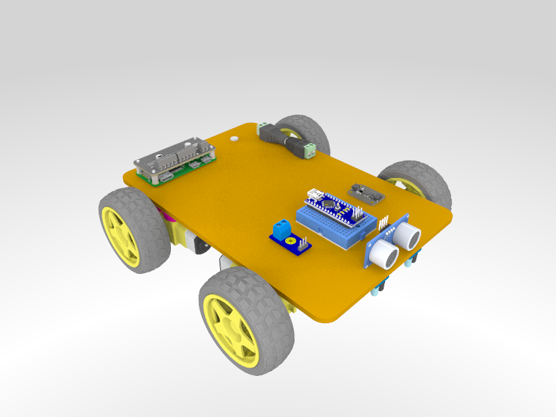

## 4WD Mini Clipboard Robot

A four wheel differential drive robot build on a small clipboard (6" by 9"). This robot build uses common "TT" motors with a 1:48 gear ratio and does not require any soldering to assemble. This is intended to be a low-cost easy to build reference robot design for beginners. It includes various sensors such as encoders, an IMU, an ultrasonic sensor, a voltage monitor, and IR reflector sensors for line following.

### Parts List

