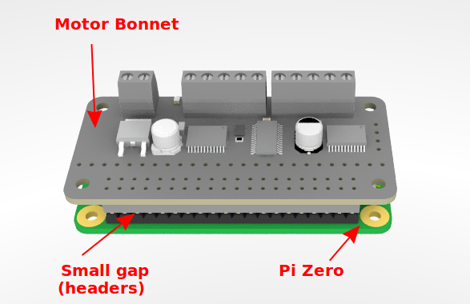
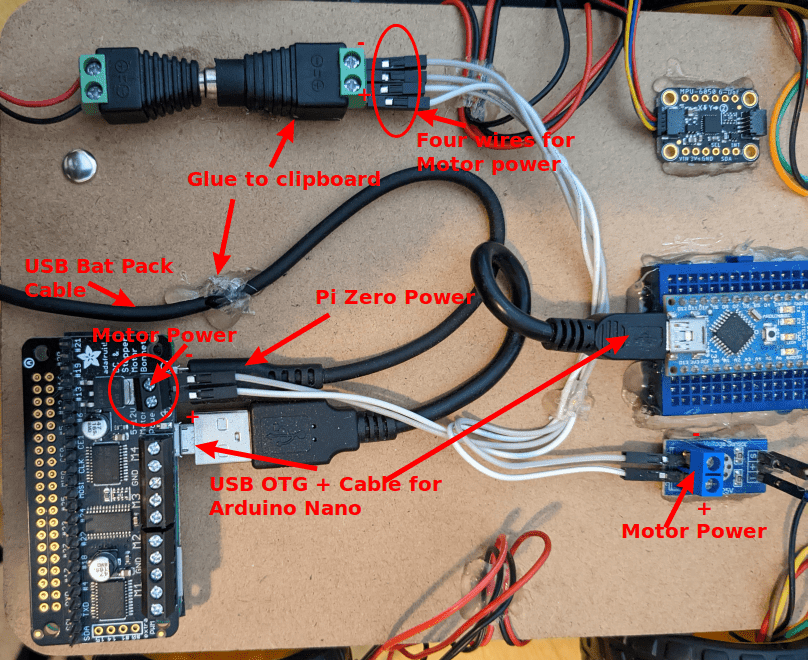

## Mini Clipboard Robot

A four wheel differential drive robot build on a small clipboard (6" by 9"). This robot build uses common "TT" motors with a 1:48 gear ratio and does not require any soldering or 3D printed parts to assemble. This is intended to be a low-cost easy to build reference robot design for beginners. It includes various sensors such as encoders, an IMU, an ultrasonic sensor, a voltage monitor, and IR reflector sensors for line following.

*This is the robot example code in the [ArPiRobot-Examples](https://github.com/ArPiRobot/ArPiRobot-Examples/) repository is designed for.*

??? info "Parts List"

    **Mechanical Parts:**

    - 1x [6"x9" Mini Clipboard with Low Profile Clip]()
    - 4x [TT Motor with Wires and Wheels]()
        - Alternate: [Motors with Wires]()
        - Alternate: [Wheels]()
    - 1x [Pack of Bingo Chips]()
    - 2x [TT Motor Encoder Disk]()

    **Electrical Parts:**

    - 1x [Raspberry Pi Zero W w/ Headers](https://www.adafruit.com/product/5291)
        - Alternate: [Raspberry Pi Zero 2 W](https://www.adafruit.com/product/3708) *no headers, must buy and solder separately*
        - Alternate: [Raspberry Pi 3A+](https://www.adafruit.com/product/4027)
    - 1x [Arduino Nano](https://www.amazon.com/Arduino-A000005-ARDUINO-Nano/dp/B0097AU5OU/)
        - Alternate: [Arduino Nano Every](https://www.amazon.com/Arduino-Nano-Every-Single-Board/dp/B07VX7MX27/)
        - Alternate: [Metro Mini 328](https://www.adafruit.com/product/2590)
    - 1x [MPU-6050 IMU Breakout](https://www.adafruit.com/product/3886)
    - 1x [Voltage Monitor Module](https://www.amazon.com/Youliang-Voltage-Detection-DC0-25v-Arduino/dp/B07TV3N46V/)
        - [Alternate](https://www.amazon.com/HiLetgo-Voltage-Detection-Arduino-Electronic/dp/B01HTC4XKY/)
    - 1x [HC-SR04 Ultrasonic Sensor](https://www.adafruit.com/product/3942)
        - [Alternate](https://www.amazon.com/Ultrasonic-HC-SR04-Distance-Measuring-Transducer/dp/B077P72HG7/)
        - [Alternate](https://www.adafruit.com/product/4007)
    - 2x [IR Reflector Module](https://www.amazon.com/HiLetgo-Infrared-Avoidance-Reflective-Photoelectric/dp/B07W97H2WS/)
        - [Alternate](https://www.amazon.com/Infrared-Obstacle-Avoidance-Sensor-Arduino/dp/B07T91JXHW/)
    - 2x [Photo-Interrupter Module](https://www.amazon.com/Willwin-Measuring-Comparator-Optocoupler-Arduino/dp/B0776RHKB1/)
        - [Alternate](https://www.amazon.com/DAOKI-Optocoupler-Sensor-Module-Arduino/dp/B01MRELRS1)
    - 1x [5AA Holder](https://www.adafruit.com/product/3456)
        - [Alternate](https://www.amazon.com/LampVPath-Battery-Holder-Leads-Wires/dp/B07WRQ44YK/) plus male [screw terminal to barrel jack adapter](https://www.adafruit.com/product/369)
    - 1x [Mini Breadboard](https://www.adafruit.com/product/65)
    - 1x [Compact USB Battery Pack](https://www.amazon.com/Anker-Upgraded-Candy-Bar-High-Speed-Technology/dp/B0744HYN4M/)
        - [Alternate](https://www.amazon.com/Miady-Portable-Charger-5000mAh-Lightweight/dp/B083VRD7CX/)
    - 1x [Pack of Jumper Wires](https://www.amazon.com/EDGELEC-Breadboard-Optional-Assorted-Multicolored/dp/B07GD2BWPY/)
        - [Alternate](https://www.amazon.com/Elegoo-EL-CP-004-Multicolored-Breadboard-arduino/dp/B01EV70C78/)
    - 1x Short USB Cable for Arudino
        - [A to Mini B](https://www.adafruit.com/product/899) (for Arduino Nano & Clones)
        - [A to Micro B](https://www.adafruit.com/product/898) (for Arduino Nano Every & Metro Mini 328)
    - 1x [USB OTG Adapter for Pi Zero](https://www.adafruit.com/product/2910)
        - [Alternate](https://www.adafruit.com/product/1099)
    - 1x [Female Barrel Jack screw terminal adapter](https://www.adafruit.com/product/368)
    - 1x [Cable for MPU-6050 Breakout](https://www.adafruit.com/product/4209)

??? info "Assembly Instructions"

    1. Motor Assemblies

        - The motor assembly consists of the motor, wheels, bingo chip spacers, and encoder disks.

        - The outside face of the motor is the face with an axel that has a "bump" on it. The front of the motor is the face opposite the actual motor.

        &nbsp;&nbsp;&nbsp;&nbsp;&nbsp;&nbsp;&nbsp;&nbsp;&nbsp;{: style="height:150px;"}

        - Bingo chips are used to construct a spacer (approx 0.25 in thick) to space the motor away from the clipboard it will eventually be mounted on. This is typically between 4 and 6 bingo chips.

        - Bingo chip spacers should be constructed using super glue. Glue a stack of bingo chips to each other to result in a 0.25 in tall stack. Eight of these stacks are necessary in total.

        - Two motors of each of two orientations are required. The first orientation requires bingo chips on the "top" face (as shown in the image above). Two require bingo chips on the bottom face. If the motors are arranged in the layout shown below, all bingo chip stacks go on the top faces.

        &nbsp;&nbsp;&nbsp;&nbsp;&nbsp;&nbsp;&nbsp;&nbsp;&nbsp;{: style="height:300px;"}

        - To attach the bingo chip stacks to the motor do **not** use super glue. Instead use hot glue. Ideally, clean each surface using isopropyl alcohol before applying hot glue (let it dry before applying glue) to ensure best adhesion. Use a decent amount of glue to ensure the motor remains attached to the bingo chips. Hot glue is used as isopropyl alcohol can be used later to easily remove it allowing the motor to be opened or replaced easily. *When placing the bingo chips, be careful with alignment. They will be slightly wider than the motor's face. Make sure the inside edge is flush. The bingo chips can overhang the outside edge slightly.*

        &nbsp;&nbsp;&nbsp;&nbsp;&nbsp;&nbsp;&nbsp;&nbsp;&nbsp;{: style="height:150px;"}

        - Once all assembled, the motors can be arranged as follows. The clipboard is then essentially placed on top.

        &nbsp;&nbsp;&nbsp;&nbsp;&nbsp;&nbsp;&nbsp;&nbsp;&nbsp;{: style="height:300px;"}

        - However, it is easier to place the motors on the clipboard one at a time. Turn the clipboard clip-side up and place each motor at the distances shown below. The outside face of each motor should be flush with the edge of the clipboard to ensure proper movement. The motors should be attached to the clipboard using hot glue. It is again recommended to clean the bingo chip faces before applying hot glue. Super glue is not recommended as it is difficult to reposition if you mess up alignment.

        &nbsp;&nbsp;&nbsp;&nbsp;&nbsp;&nbsp;&nbsp;&nbsp;&nbsp;{: style="height:300px;"}

        &nbsp;&nbsp;&nbsp;&nbsp;&nbsp;&nbsp;&nbsp;&nbsp;&nbsp;{: style="height:150px;"}

        - Finally, add the wheels to all motors (outside shaft) and add an encoder disk to the inside shaft of the front two motors (front is side without the clip).

        &nbsp;&nbsp;&nbsp;&nbsp;&nbsp;&nbsp;&nbsp;&nbsp;&nbsp;{: style="height:300px;"}

        &nbsp;&nbsp;&nbsp;&nbsp;&nbsp;&nbsp;&nbsp;&nbsp;&nbsp;{: style="height:300px;"}

    2. Electronics

        - Place the motor bonnet on top of the Raspberry Pi Zero (solder header to Pi Zero if required first). When fully seated, there may be a small gap. This is ok.

        &nbsp;&nbsp;&nbsp;&nbsp;&nbsp;&nbsp;&nbsp;&nbsp;&nbsp;{: style="height:200px;"}

        - This assembly (pi and bonnet) can then be attached to the clipboard. Place electrical tape on the bottom of the Raspberry Pi (to protect the PCB from hook and loop tape adhesive). Then apply hook tape. Place loop tape in the correct spot on the clipboard and attach the Raspberry Pi using the hook and loop tape.

        &nbsp;&nbsp;&nbsp;&nbsp;&nbsp;&nbsp;&nbsp;&nbsp;&nbsp;{: style="height:300px;"}

        - Next, place the Arduino Nano in the mini breadboard as shown below. Notice that one side has three rows on the breadboard and the other only has two. Also notice that the "back" of the breadboard has one empty row not obstructed by the row. Matching this is important.

        &nbsp;&nbsp;&nbsp;&nbsp;&nbsp;&nbsp;&nbsp;&nbsp;&nbsp;{: style="height:200px;"}

        - The add the breadboard in the position shown below. The breadboard likely has adhesive tape on the bottom. If not, electrical tape followed by hook and loop tape can be used as was done for the Raspberry Pi.

        &nbsp;&nbsp;&nbsp;&nbsp;&nbsp;&nbsp;&nbsp;&nbsp;&nbsp;{: style="height:300px;"}

        - Next add the top-side sensors in the indicated positions. These are attached directly to the clipboard using hot glue. Generally, the PCB is set directly onto the clipboard and hot glue is applied around the edges (not under the board). This makes it easier to remove if needed. For the ultrasonic sensor, hot glue is generally placed under the metal rings around the emitter and receiver. Note that the ultrasonic sensor's front face is flush with the front edge of the clipboard.

        &nbsp;&nbsp;&nbsp;&nbsp;&nbsp;&nbsp;&nbsp;&nbsp;&nbsp;{: style="height:300px;"}

        &nbsp;&nbsp;&nbsp;&nbsp;&nbsp;&nbsp;&nbsp;&nbsp;&nbsp;{: style="height:200px;"}

        - Then, add the following sensors in the indicated positions on the bottom of the board. These too are attached using hot glue on the sides of the PCBs.

        &nbsp;&nbsp;&nbsp;&nbsp;&nbsp;&nbsp;&nbsp;&nbsp;&nbsp;{: style="height:300px;"}

        - Finally, use hook and loop tape to attach both the AA battery pack and USB battery pack in the positions shown below.

        &nbsp;&nbsp;&nbsp;&nbsp;&nbsp;&nbsp;&nbsp;&nbsp;&nbsp;{: style="height:300px;"}
    
    3. Wiring (Non-Sensor Cables)

        - Connect the USB OTG adapter to the Raspberry Pi Zero's USB host port (inner one; outer one is for power).

        &nbsp;&nbsp;&nbsp;&nbsp;&nbsp;&nbsp;&nbsp;&nbsp;&nbsp;{: style="height:200px;"}

        - Then connect the USB A to Mini B cable (or Micro B cable depending on the sensor coprocessor board used). The USB A (rectangle) side should be connected to the OTG adapter on the Raspberry Pi Zero and the Mini / Micro B should be connected to the Arduino Nano (or other board as applicable).

        - The USB Battery pack should have come with a USB A to Micro B cable. This will be used to power the raspberry Pi. Connect the micro B end to the Raspberry Pi's power port. It is recommended to use hot glue to secure this cable on top of the clipboard and let it hang over the back. Only plug this into the battery pack when you are using the robot.

        - Motor battery power should go to the motor bonnet power ports. Place the female barrel jack screw terminal adapter where shown. In each screw terminal port, two jumper wires (male to male) are needed (four wires total). One power and one ground (one each + and -) go to cooresponding places on the motor hat. The other pair goes to the voltage monitor

        &nbsp;&nbsp;&nbsp;&nbsp;&nbsp;&nbsp;&nbsp;&nbsp;&nbsp;{: style="height:300px;"}

        - To connect motor battery power, bring the AA battery pack wires around the back of the clipboard and connect the barrel jack to the female one. If your AA battery pack does not have a male barrel jack connector installed, add one with screw terminal blocks (you may need to strip off some wire insulation).

        - When done, the robot should look something like the following

        &nbsp;&nbsp;&nbsp;&nbsp;&nbsp;&nbsp;&nbsp;&nbsp;&nbsp;{: style="height:300px;"}

        - Finally, connect the motor cables to the correct places on the motor bonnet. Motor numbers are shown below. Order of red and black wires in these ports does not matter. Swapping red and black (for the same motor) will invert its direction. You may want to use hot glue or tape to keep the wires on top of the clipboard.

        | Motor           | Number |
        | --------------- | ------ |
        | Front Left      | 3      |
        | Rear Left       | 4      |
        | Front Right     | 2      |
        | Rear Right      | 1      |

        &nbsp;&nbsp;&nbsp;&nbsp;&nbsp;&nbsp;&nbsp;&nbsp;&nbsp;{: style="height:300px;"}

    4. Wiring (Sensor Cables)

        - First, you need to know how breadboards work. Each row of pins is connected internally. To connect a wire to a pin on the Arduino Nano, plug it into the same row on the breadboard.

        &nbsp;&nbsp;&nbsp;&nbsp;&nbsp;&nbsp;&nbsp;&nbsp;&nbsp;{: style="height:200px;"}

        - Next, more sensors will need connections to the 3.3V pin (3V3) and GND pins than are available on the breadboard. As such, the two empty rows need to be connected to 3.3V and GND. This provides four extra GND and 3.3V pins. Note that the MPU6050 has a cable that connects to either port on the short sides of the board. This cable has four jumper wire pins on the other end that are connected to the breadboard.

        TODO: Image

        - Then connect each sensor as follows using jumper wires
    
        | Sensor            | Sensor Pin  | Arduino Nano |
        | ----------------- | ----------- | ------------ |
        | Voltage Monitor   | -           | GND          |
        | Voltage Monitor   | S           | A0           |
        | Ultrasonic        | VCC         | 5V           |
        | Ultrasonic        | GND         | GND          |
        | Ultrasonic        | TRIG        | 7            |
        | Ultrasonic        | ECHO        | 8            |
        | Left Encoder      | VCC         | 3.3V         |
        | Left Encoder      | GND         | GND          |
        | Left Encoder      | D0          | D2           |
        | Right Encoder     | VCC         | 3.3V         |
        | Right Encoder     | GND         | GND          |
        | Right Encoder     | D0          | D3           |
        | Left IR           | VCC         | 3.3V         |
        | Left IR           | GND         | GND          |
        | Left IR           | OUT         | D11          |
        | Right IR          | VCC         | 3.3V         |
        | Right IR          | GND         | GND          |
        | Right IR          | OUT         | D12          |
        | MPU6050           | Red Wire    | 5V           |
        | MPU6050           | Black Wire  | GND          |
        | MPU6050           | Yellow Wire | A5           |
        | MPU6050           | Blue Wire   | A4           |

        - To connect the sensors on the bottom, it is recommended to bring the wires around the front of the clipboard and use hot glue or tape to keep them from hanging off the robot too much.

        - Twist ties, electrical tape, and hot glue can be used for cable management. When fully wired, it should look something like the following images

        &nbsp;&nbsp;&nbsp;&nbsp;&nbsp;&nbsp;&nbsp;&nbsp;&nbsp;{: style="height:400px;"}

        &nbsp;&nbsp;&nbsp;&nbsp;&nbsp;&nbsp;&nbsp;&nbsp;&nbsp;{: style="height:300px;"}

