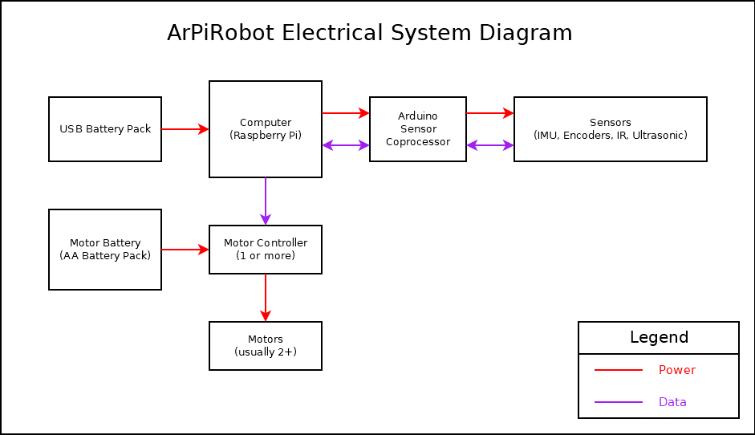
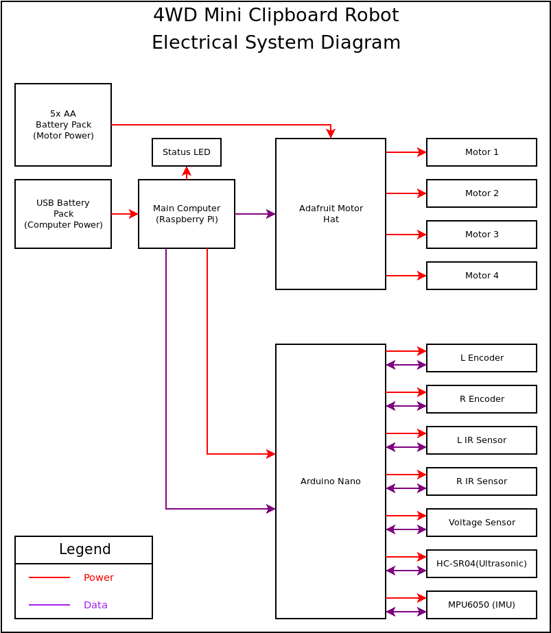

## Mechanical Components

The mechanical components of your robot include structural components and physical parts that make up various systems on the robot and make the robot function. The mechanical components used on a robot will vary widely depending on what the robot is designed to do. The following list is a guideline set of components necessary for a simple drive base (robot that just drives). Additional systems on the robot to perform different tasks, or robots designed to move in different ways, will likely need a very different set of components.

### Major Drive Base Components

- Base / Frame / Chassis: This is the foundation that the rest of the robot is built on. This may be made up of several components. A "base" is typically just a flat plane that other mechanical components are attached to. A "frame" is typically an "outline" which components are attached to. Often, a flat plane will be placed on top of a frame to allow space for electronics, but items such as motors are attached on the sides. A chassis is more of a generic term in this context.
- Motors: Motors are used to spin wheels to make the robot drive. Typically, either two or four motors are used, with an even number on each side. If only two are used, a caster wheel is often required for stability. Alternatively, two "free spinning" wheels could be used instead (robot would have four wheels, but two motors). However, this configuration is often less ideal than a caster as steering is more difficult.
- Wheels: Attach to motors, or in the case of a caster, to the drive base / frame / chassis.
- Mounting Hardware: Screws, nuts, bolts, etc. Anything that you plan to use to attach components to each other.
- Spacers: Washers or other 3d printed / metal / other spacers to place components where desired when attaching.

## Electrical Components

Unlike the physical construction of the robot, the requirements for a robot's electrical system are often very similar. While there will be minor differences depending on specifically what a robot does, the main types of components needed often do not change.

###  Major Components

- Main Computer: The main computer is what runs the robot software. This is an embedded computer running a Linux operating system. Often, Raspberry Pi boards are used.
- Motor Power Source: The power source used to power motors. Often this is a set of AA batteries, or a rechargeable battery pack.
- Computer Power Source: The power source used to power the computer (and other devices powered from the computer). In many cases, this is a second battery in the form of a USB battery pack (rechargeable). However, this can also sometimes be regulated from the same source powering motors.
- Motion controllers: These components are used to control the robot's motion. This includes devices such as motor controllers used to move motors on the robot.
- Sensor Coprocessor: A microcontroller (or microcontroller dev board) capable of interfacing with sensors on the robot. Communicates important information back to the main computer. Often, Arduino development boards are used.
- Sensors: Any device on the robot used to provide the software information about the robot or its environment. Includes encoders, IMUs (gyro, accelerometer, magnetometer), voltage sensors, ultrasonic sensor, IR reflection detectors, etc
- Indicators: Any device used to convey information to the robot's user. Typically, these are just LEDs.

A general block diagram of an ArPiRobot electrical system is shown below

### Example Block Diagram

The following is a block diagram of an electrical system for a 4 wheel drive robot including several sensors.

## Tools and Other Components

There are a few "minor" components and tools that are sometimes necessary as well. These are listed below.

- Micro SD Card: Required to boot the computer (in most cases). Stores the computer's OS and the robot's program files.
- USB Cables: Required to connect some components. Typically, a USB cable is needed to connect a sensor coprocessor to the main computer and to connect the computer power source to the computer.
- Jumper Wires: Used to connect various components on the robot to each other (sensors, motors, etc)
- Breadboards: Used to connect sensor and other devices using jumper wires. No soldering required.
- Solder Iron: Used to assemble electronic components. Required to assemble some sensor boards, solder headers to some main computers, or connect wires to some motors. Most of the time, it is possible to avoid soldering if you want to do so, but some components will no be available assembled or may be more expensive assembled.
- Wire Strippers: Used to remove insulation from wires. Useful if you are making your own jumper wires or attaching wires to motors yourself. Not always required.
- Electrical Tape: Used to cover contacts to prevent shorting. Also useful for cable management.
- Hook and Loop Tape: Often incorrectly referred to by the brand name "Velcro". Used to attach components to the robot. Note that if using to attach PCBs, electrical tape is also recommended.
- Hot Glue & Glue Gun: Useful to attach components and for wire management
- Super glue: Useful to attach components with more stress on them
- Ruler: Useful during assembly at times
- Screwdrivers: Used with screws to assemble mechanical components (if necessary). Small screwdrivers are also used with various electrical components to connect wires (in screw terminal blocks).
- Wrenches: Used during assembly of mechanical components

## Selecting Components

The next section includes lists of supported hardware. Choosing items from this list will ensure full compatibility. Generally, you will want to determine the physical construction of your robot first. Then choose one or more of each component from the lists above as required. 

Generally, one of each component is necessary. More than one motor controller may be needed depending on which motor controller(s) and how many motors are on the robot. Additionally, the sensors used on your robot depend on its physical construction and what you want it to do. It is also possible to build a robot without sensors, in which case a sensor coprocessor is not needed. There is also a small selection of sensors that work directly with the main computer and do not require a sensor coprocessor. More details on the supported hardware page.

Alternatively, some example robot builds are documented. If you're less experienced with robotics, it may be beneficial to start with one of these examples, instead of a custom build.