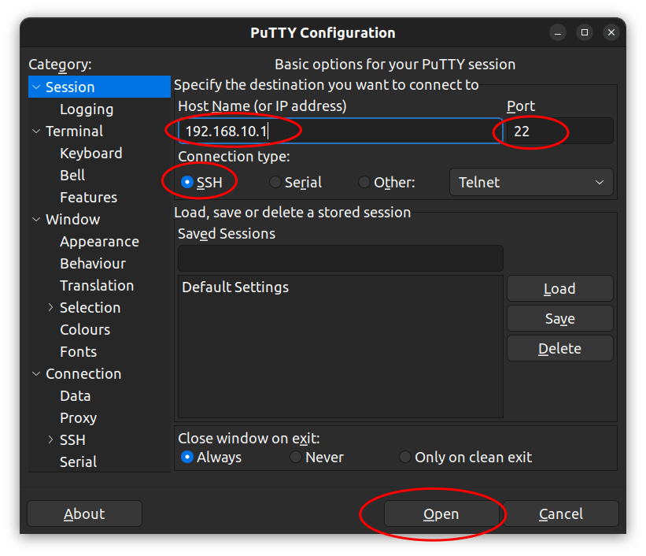

# Connect By SSH

While the ArPiRobot framework is designed such that logging in to the Pi via SSH is unnecessary, it may sometimes be required or desired to debug certain features or change settings that may be otherwise unavailable.


### What is SSH

In simple terms SSH is a way to login to another computer over a network (such as WiFi). In this case, we can log into the Raspberry Pi on the robot from a PC that is connected to the robot's WiFi network.

When logged in via SSH there is no graphical environment (no desktop, start menu, mouse, etc). SSH provides only a command line interface (similar to using command prompt on Windows or the terminal app on macOS). If you are not familiar with using a Linux shell CLI, you probably have little reason to log into the robot using ssh. However, if you want to learn more you can look at [this](https://www.linux.com/training-tutorials/how-use-linux-command-line-basics-cli/) tutorial or [this](https://ubuntu.com/tutorials/command-line-for-beginners#1-overview) one.


### Installing a SSH Client on your Computer

Most modern operating systems include the OpenSSH client by default. Linux distributions and macOS have included it for a long time. More recently Windows 10 began including OpenSSH's client by default. The OpenSSH client is a command line program that connects to another device by ssh. The other device must be running an SSH server (which the Pi on the robot is). 

The OpenSSH client is invoked by running the `ssh` command in a terminal (or command prompt on Windows). Run the following command to list the OpenSSH version

```sh
ssh -V
```

If you see an error about the command not being found (or ssh not being a valid command) you do not have OpenSSH installed (or it may not be in your PATH if you installed it on an older version of windows). If you are using Windows 10 and `ssh` is not found you may need to [install the feature](https://docs.microsoft.com/en-us/windows-server/administration/openssh/openssh_install_firstuse).

If you are on an older version of windows that does not include OpenSSH you can [install it](https://github.com/PowerShell/Win32-OpenSSH/wiki/Install-Win32-OpenSSH). win32-openssh can also be installed using the [scoop](https://scoop.sh/) package manager for windows. Alternatively, use PuTTY as described below. 

<br />

There are other ssh clients that can be used. One of the most popular of which is [PuTTY](https://www.chiark.greenend.org.uk/~sgtatham/putty/latest.html). PuTTY provides a graphical interface to configure the SSH session and connect. It is particularly commonly used on Windows operating systems, but many Linux distributions have PuTTY builds in their package repositories. On macOS putty can be installed using [Homebrew](https://brew.sh/).


### Connecting to the Robot

The following information is required to connect to the robot's Pi. You must already be connected to the robot's WiFi.

Address: `192.168.10.1`  
Port: `22` (default for SSH)  
Username: `pi`  
Password: `arpirobot`  
*This information is the same as documented on the [Default Settings](../../defaultsettings.md) page.*


**OpenSSH:**

To connect using OpenSSH's client run the following command

```sh
# ssh -l [username] [address]
# Port is omitted because default is 22
ssh -l pi 192.168.10.1
```

You will likely be asked to approve the host's key. This is a way of making sure you are connecting to the device you intended. Simply type "yes" and press enter. You will not be asked again. However, if you connect to a different robot, you will get an error because the key will have changed and, but the address is the same. In this case you have to remove the entry from `~/.ssh/known_hosts`. Alternatively, see the "Ignoring SSH Host Key" section below. After approving the key (if necessary) enter the password. You will then be logged in.


**PuTTY**

Select "SSH" for the connection type. Enter the address in the "Host name" field. Make sure the port is set to `22` (it will be by default if the connection type is SSH). Then, click Open.

{: style="height:300px"}

If prompted accept the key. If you connect to a different robot (same IP, different key) PuTTY will warn you, but give you a button to connect anyways.

You will then be prompted for the username ("login as") and the password. Enter both and you will have a shell session.


### Ignoring SSH Host Key

*Note: This applies only to the OpenSSH client, not PuTTY.*

Each Pi has its own ssh host key. As such, when working with several robots you may run into issues where the current key does not match the one in `~/.ssh/known_hosts`. As such, it may be desirable to ignore the host key for this specific IP address (`192.168.10.1`). This can be done by adding the following to the `~/.ssh/config` file (`C:\username\.ssh\config` on windows).

```
Host 192.168.10.1
    StrictHostKeyChecking no
    UserKnownHostsFile=/dev/null
```

On windows instead of `/dev/null` use `nul` so it becomes

```
Host 192.168.10.1
    StrictHostKeyChecking no
    UserKnownHostsFile=nul
```
