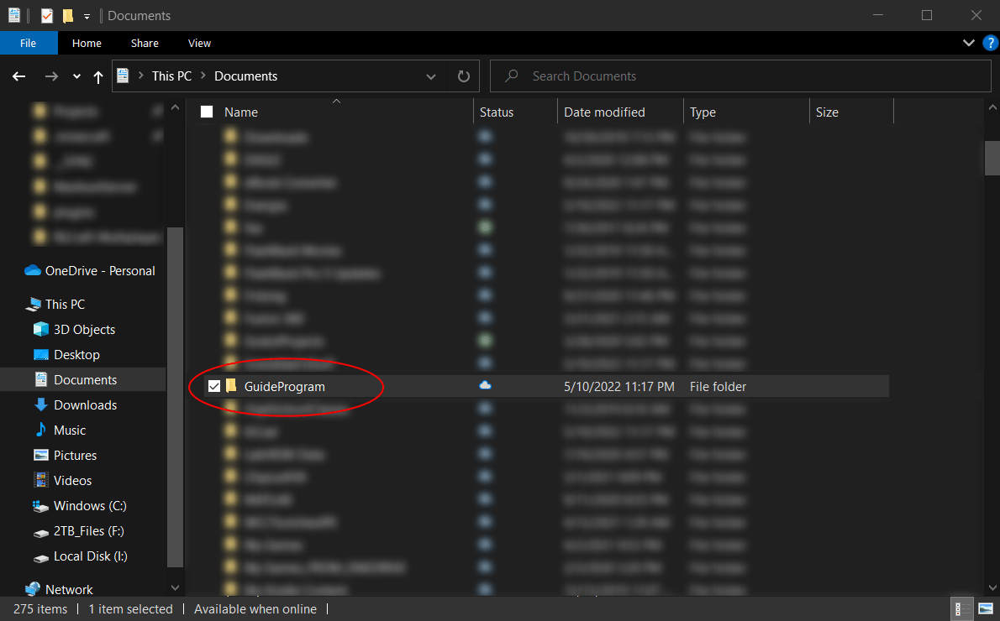
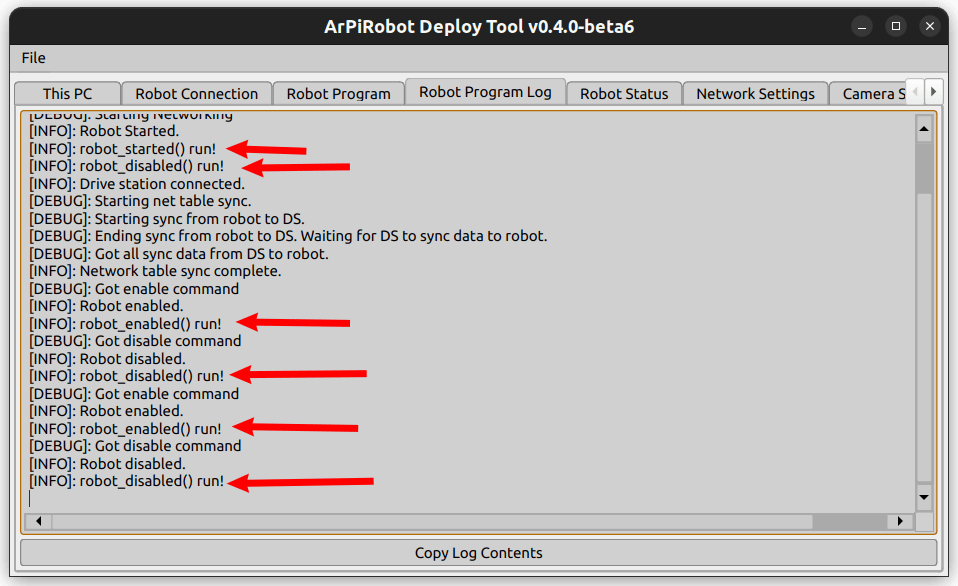

# Creating a Project

This portion of the guide will walk you through creating a robot project and running it on your robot. In addition, the basic structure of a robot program will be explained. 


## About this Guide

This guide is written to be fairly generic in regards to the robot build used. However, the following assumptions are made.

- Robot uses a differential drive system. This means that the robot has motorized wheels on both left and right sides of the robot and steers by varying the speeds of each side. Most robots use this style drive system.
- The [Sensors & Network Table](./sensordata.md) section assumes the robot has an ultrasonic sensor facing forward and an IMU. Both are assumed to be connected to an Arduino coprocessor.
- The [Using Sensors with Actions](./sensoractions.md) section assumes the robot has an IMU and 2 encoders (one on the left side and one on the right side). The encoders can be single channel or quadrature encoders.
- The [PID Controller](./pid.md) section assumes the robot has an IMU.

Additionally, code is written as if it were to run on the 4-wheel drive clipboard (or mini clipboard) robot builds as described in [Example Robot Builds](../hardware/examplebuilds.md). Comments are made in various places about what should be changed for other robots (generally this is just due to a different number of motors).

Finally, some sections of this guide build on previous sections. It is generally assumed that this guide is followed in order.


## Creating a New Project

A project is a collection of code files that makeup one robot program. A new project can be created using VSCode with the ArPiRobot extension installed. When VSCode is opened there will be an `ArPiRobot` button along the bottom toolbar.

{: style="height:300px"}

After clicking this button a menu will open with an option to create an ArPiRobot project. Click this option.

{: style="height:300px"}

After clicking this option you will be prompted to choose a programming language. Choose the language you plan to use.

{: style="height:300px"}


Once the language has been selected enter the project name. The project name is your choice. In this case, `GuideProgram` would be a good choice. 

{: style="height:300px"}

Finally, choose a location to create the project. If in doubt, use your `Documents` folder.

{: style="height:300px"}

Each project has its own folder which will be created in the location selected. The folder name is the same as the project name. For example, if your project is named `GuideProgram` and the parent directory is `Documents` the project will be `Documents/GuideProgram`.

{: style="height:300px"}

Once the project has been created it will be opened in VSCode. If you want to open the same project later open VSCode and use the `File > Open Folder` option (or just `File > Open...` on macOS) to open the project's folder. The project will be created with several files, described below.

If you generated a C++ project you will be prompted to "configure" the project when you open it. Click yes to configure the project. If prompted to select a kit choose "Raspberry Pi Toolchain"


=== "Python Project Files"
    A Python project is generated with several source (`.py`) files in a folder named `src`. The other files generated are either used on the robot to start the program or used by the deploy tool to deploy the project.

    {: style="height:300px"}

=== "C++ Project Files"
    A C++ project is generated with several source (`.cpp`) files in a folder named `src` and headers (`.hpp`) in a folder named `include`. The other files generated are used on the robot to start the program, used by the deploy tool to deploy the project, or are part of the build system.

    {: style="height:300px"}


## Deploying to Robot

The project is created with a minimal amount of code to make it a valid robot program. As such, it can be deployed to the robot immediately to verify it runs and to learn how to deploy code.

Before deploying a project it is sometimes necessary to "build" the project. In simple terms "building" means taking the source code and translating it into a form that can be run. What exactly this process entails, and whether it is necessary, depends on the programming language.

=== "Python"
    Python projects do not need to be "built". The source code is deployed directly.

=== "C++"
    C++ projects must be built before they can be deployed. Before building, select the Raspberry Pi Toolchain "kit" for CMake in VSCode. If you do not see this option, the project is not "configured". Press `Ctrl+Shift+P` (`Cmd+Shift+P` on macOS) and type "CMake: Configure" and run that command. The pictured options should then be on the bottom toolbar.

    {: style="height:300px"}

    Then click the build button to build the project.

    {: style="height:300px"}

    A window will open with build output. It should build with no errors.

    {: style="height:300px"}


After building, deploying to the robot is done using the Deploy Tool. First, connect your computer to the robot's WiFi network (the robot will of course need to be powered on). After this is done open the Deploy Tool and click the "Connect" button.

{: style="height:300px"}

Next select the Robot Program tab. In this tab click the three dots button and choose the folder for the project. Finally, click the deploy button. The Deploy Tool will then perform several tasks to deploy the program. No errors should be reported.

{: style="height:300px"}

Once the program has been deployed select the "Robot Program Log" tab. You should see some output similar to the following. The "robot started line" indicates that the robot program has started successfully.

{: style="height:300px"}


## The Robot Program

The core of the robot program lies either in the `robot.py` or `robot.cpp` (and `robot.hpp`) file(s). This file implements a class called `Robot` that inherits from (is based on) `BaseRobot`. `BaseRobot` is part of the CoreLib and handles starting and managing the robot program. The `Robot` class based on it is capable of modifying certain behaviors by implementing some functions. If you look in `robot.py` or `robot.hpp` several functions are defined with comments explaining their use. These functions are listed below

=== "Python"
    - `robot_started`: This function runs one time when the robot program starts running. This function is used to configure things that only need to happen once at the start of the robot program.
    - `robot_enabled`: There are two states the robot can be in. When enabled, motors and other devices that could be considered "potentially harmful" are allowed to function. This function is run each time the robot becomes enabled (switches from disabled to enabled). This function is used to "prepare" for the enabled state.
    - `robot_disabled`: This function is run when the robot becomes disabled. When disabled "potentially harmful" devices (such as motors) are disabled automatically. The robot automatically becomes disabled if the Drive Station becomes disconnected (or under some other scenarios). This function is often used to stop anything that should not happen while the robot is disabled. Note that stopping motors manually is not necessary as they are automatically stopped when the robot becomes disabled.
    - `periodic`: This function runs over and over while the robot program is running. By default this function runs once every 50ms. This function runs if the robot is enabled or if it is disabled. It is used to do things that should happen repeatedly always.
    - `enabled_periodic`: This function runs over and over, similar to `periodic`, but only if the robot is enabled. This function is often used to implement the control of the robot.
    - `disabled_periodic`: This function runs over and over, similar to `periodic`, but only if the robot is disabled.

=== "C++"
    - `robotStarted`: This function runs one time when the robot program starts running. This function is used to configure things that only need to happen once at the start of the robot program.
    - `robotEnabled`: There are two states the robot can be in. When enabled, motors and other devices that could be considered "potentially harmful" are allowed to function. This function is run each time the robot becomes enabled (switches from disabled to enabled). This function is used to "prepare" for the enabled state.
    - `robotDisabled`: This function is run when the robot becomes disabled. When disabled "potentially harmful" devices (such as motors) are disabled automatically. The robot automatically becomes disabled if the Drive Station becomes disconnected (or under some other scenarios). This function is often used to stop anything that should not happen while the robot is disabled. Note that stopping motors manually is not necessary as they are automatically stopped when the robot becomes disabled.
    - `periodic`: This function runs over and over while the robot program is running. By default this function runs once every 50ms. This function runs if the robot is enabled or if it is disabled. It is used to do things that should happen repeatedly always.
    - `enabledPeriodic`: This function runs over and over, similar to `periodic`, but only if the robot is enabled. This function is often used to implement the control of the robot.
    - `disabledPeriodic`: This function runs over and over, similar to `periodic`, but only if the robot is disabled.

By putting code in these functions, a robot program can be made to perform a wide variety of tasks. For now, to get a better feel for when these functions run, the following modifications can be made to the program to add some custom log messages. When the function containing a log message is run, the message is printed to the log. The added lines are indicated in the code below.

=== "Python (`robot.py`)"
    ```py
    from arpirobot.core.robot import BaseRobot
    from arpirobot.core.log import Logger
    from arpirobot.core.action import ActionManager
    from arpirobot.core.network import NetworkTable

    # Import devices and other things here

    # Import actions here
    # from actions import ...

    class Robot(BaseRobot):
        def __init__(self):
            # Do not remove this line
            super().__init__()

            # Create devices and constants as member variables here
            # self.device_var = DeviceClass(args)

            # Only create the devices here. Do not configure them here!
        
        def robot_started(self):
            # Run once when the robot starts
            # Configure devices here
            Logger.log_info("robot_started() run!")

        def robot_enabled(self):
            # Runs once each time the robot becomes enabled
            Logger.log_info("robot_enabled() run!")

        def robot_disabled(self):
            # Runs once each time the robot becomes disabled
            Logger.log_info("robot_disabled() run!")

        def enabled_periodic(self):
            # Runs periodically while the robot is enabled
            pass

        def disabled_periodic(self):
            # Runs periodically while the robot is disabled
            pass

        def periodic(self):
            # Runs periodically (regardless of robot state)

            # Do not remove this line or some devices will be disabled
            self.feed_watchdog()

    ```

=== "C++ (`robot.cpp`)"
    ```cpp
    #include <robot.hpp>

    #include <arpirobot/core/log/Logger.hpp>
    #include <arpirobot/core/action/ActionManager.hpp>
    #include <arpirobot/core/network/NetworkTable.hpp>

    using namespace arpirobot;


    void Robot::robotStarted(){
        Logger::logInfo("robotStarted() run!");
    }

    void Robot::robotEnabled(){
        Logger::logInfo("robotEnabled() run!");
    }

    void Robot::robotDisabled(){
        Logger::logInfo("robotDisabled() run!");
    }

    void Robot::enabledPeriodic(){

    }

    void Robot::disabledPeriodic(){

    }

    void Robot::periodic(){
        // Do not remove this line or some devices will be disabled.
        feedWatchdog();
    }
    ```

The above program adds custom log messages in the `robot_started` / `robotStarted`, `robot_enabled` / `robotEnabled`, and `robot_disabled` / `robotDisabled` functions. The periodic functions do not have log messages in them to avoid logging excessive information (these functions run every 50ms = 20 times per second).

<br />

Build the program (if applicable) and deploy it to the robot. Then, open the drive station and wait for it to connect to the running program (wait for both the "Network" and "Robot Program" indicators to become green). Once it does click the enable and disable buttons a few times.

{: style="height:300px"}

After doing so, log output similar to the following should be visible in the deploy tool. Some of this log output will also be visible in the robot program log tab of the drive station, however the drive station only shows the log messages after the drive station was connected. The deploy tool shows log messages for the entire program.

{: style="height:300px"}

As seen above, the `robot_started` / `robotStarted` function runs only once, whereas the `robot_enabled` / `robotEnabled` and `robot_disabled` / `robotDisabled` run multiple times (depending on how many times the robot was enabled / disabled from the drive station).
