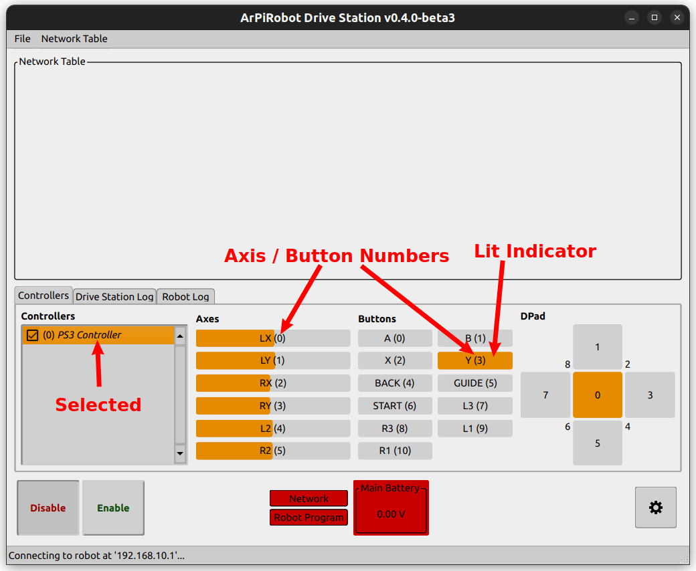

# Driving with Gamepad

Now that motor objects are setup and you know the basics of moving motors, it is time to begin driving the robot.

## Motor Positions and Directions

Before starting to drive the robot, it is important to know which motor object in code cooresponds to which physical motor. For example, on a two wheel drive robot, you need to know if motor A is left or right (and the same for motor B). For a four wheel drive robot, you needs to know which motor is front left, front right, rear left, and rear right. This is easily determined by examining the wiring on your robot (follow the wires from a specific motor to the motor controller to determine which motor it is). Once you've done this, it is a good idea to change the name of your motor variables to be something more relevant. For example on a two wheel drive robot instead of `motor_a` and `motor_b` you could use `lmotor` and `rmotor` (left and right motor). On a four wheel drive robot you could use `flmotor`, `frmotor`, `rlmotor`, and `rrmotor` (front left, front right, rear left, rear right). You can rename the motor objects using something like what is shown below

=== "Python (`robot.py`)"
    ```py
    # Somewhere in __init__
    self.motor1 = ...
    self.motor2 = ...
    self.motor3 = ...
    self.motor4 = ...

    # Change to something like the following
    # Make sure to use the correct numbers for each motor
    self.flmotor = ...
    self.frmotor = ...
    self.rlmotor = ...
    self.rrmotor = ...
    ```

=== "C++ (`robot.hpp`)"
    ```cpp
    // At the bottom of the Robot class declaration
    MotorType motor1 = ...;
    MotorType motor2 = ...;
    MotorType motor3 = ...;
    MotorType motor4 = ...;

    // Change to something like the following
    // Make sure to use the correct numbers for each motor
    // This may also be in the initializer list of a constructor 
    // depending on which motor controller you use
    MotorType flmotor = ...;
    MotorType frmotor = ...;
    MotorType rlmotor = ...;
    MotorType rrmotor = ...;
    ```

To check if you have each motor correct add a line like the following to `robot_enabled` / `robotEnabled` for the front left motor (or just the left motor on a two-wheel drive robot). Build (if required) and deploy the robot code. When enabled, the front left (or left) wheel should spin. Repeat this for all motors and make changes as needed.

=== "Python (`robot.py`)"
    ```py
    def robot_enabled(self):
        self.flmotor.set_speed(1)
    ```

=== "C++ (`robot.cpp`)"
    ```cpp
    void robotEnabled(){
        flmotor.setSpeed(1);
    }
    ```

Now that it is easy to identify which motor is which from your code, it should be easy to make sure all motors spin the "correct" direction. In this case "correct" means that all motors spin the same direction when given a positive value. Often it is best to choose positive to be forward, therefore for this section "correct" will mean that a motor spins such that the robot would move forward when given a positive speed.

To determine which motors need to be inverted, replace `robot_enabled` / `robotEnabled` with the following. If you have a two wheel drive robot, change the motor names and only keep two lines.

=== "Python (`robot.py`)"
    ```py
    def robot_enabled(self):
        self.flmotor.set_speed(1)
        self.frmotor.set_speed(1)
        self.rlmotor.set_speed(1)
        self.rrmotor.set_speed(1)
    ```

=== "C++ (`robot.cpp`)"
    ```cpp
    void robotEnabled(){
        flmotor.setSpeed(1);
        frmotor.setSpeed(1);
        rlmotor.setSpeed(1);
        rrmotor.setSpeed(1);
    }
    ```

Build and deploy the program to the robot. When enabled all motors should begin spinning. If any are spinning the incorrect direction (incorrect meaning they would make the robot move in reverse) add a line like the following in `robot_started` / `robotStarted` to invert its direction.

=== "Python (`robot.py`)"
    ```py
    # If front left motor is incorrect add the following
    # Change motor name as needed
    # Add for multiple motors if needed
    self.flmotor.set_inverted(True)
    ```

=== "C++ (`robot.cpp`)"
    ```cpp
    // If front left motor is incorrect add the following
    // Change motor name as needed
    // Add for multiple motors if needed
    flmotor.setInverted(true);
    ```

After adding these lines, rebuild and deploy. Enable the robot again and all motors should move the robot forward.


## Drive Helpers

Now that you know which motor is which and all spin the correct direction, the problem becomes how to choose a speed for the motors. The plan is to use a gamepad to drive the robot, but what specifically should control the motor movement? One method would be to drive the robot at a fixed speed when a button is held, but that is relatively limited. Another option would be to use a joystick to control a specific motor, or a set of motors, however this may require multiple lines of code to do the same thing to multiple motors or it may require calculations to determine a motor's speed. Two common control schemes are described below

**Tank Drive** is a method where you use the vertical axes on a controller to control the robot. The left stick is moved up / down to control the speed of the left motors. The right stick is moved up / down to control the speed of the right motors. This method requires no special calculations as the motor's speeds come directly from axis values, but you may have to set the same speed to many motors at a time, making it easy to miss one and have an issue in your code. Additionally, this method of control is not very "easy" to use.

**Arcade Drive** is a method where a vertical axis controls the robot's speed and a horizontal axis controls the robot's rotation. These could be two axes on the same stick or on different sticks. Often, the left stick would be moved up / down to control the robot's forward speed and the right stick would be moved left / right to rotate the robot. This is a more intuitive method of controlling the robot, however it requires that some calculations be performed using the joystick values to determine how fast each motor should spin.

As explained above, using joystick axes to control the robot is sometimes difficult, however the ArPiRobot core library (corelib) provides "drive helpers" to enable these control schemes to work easily. The following code will focus on the Arcade drive scheme as it is easier to use and often preferred. The corelib provides a `ArcadeDriveHelper` object which manages motor speeds. The drive helper is given a "speed" and "rotation". It calculates how fast each motor should be moving based off this and controls the motor speeds. To use `ArcadeDriveHelper` add the following to the top of `robot.py` or `robot.hpp` with the other imports / includes.

=== "Python (`robot.py`)"
    ```py
    from arpirobot.core.drive import ArcadeDriveHelper
    ```

=== "C++ (`robot.hpp`)"
    ```cpp
    #include <arpirobot/core/drive/ArcadeDriveHelper.hpp>
    ```

Then add the following at the indicated location

=== "Python (`robot.py`)"
    ```py
    # Add in __init__ with other devices (after motors)
    self.drive_helper = ArcadeDriveHelper(
        [self.flmotor, self.rlmotor],           # Left motors
        [self.frmotor, self.rrmotor]            # Right motors
    )

    # For a 2-wheel robot use this instead
    self.drive_helper = ArcadeDriveHelper(
        self.lmotor,                            # Left motor
        self.rmotor                             # Right motor
    )
    ```

=== "C++ (`robot.hpp`)"
    ```cpp
    // Add with device declarations (after motors)
    ArcadeDriveHelper driveHelper {
        {flmotor, rlmotor},                     // Left motors
        {frmotor, rrmotor}                      // Right motors
    };

    // For a 2-wheel robot use this instead
    ArcadeDriveHelper driveHelper {
        lmotor,                                 // Left motor
        rmotor                                  // Right motor
    };
    ```

Finally, replace `robot_enabled` / `robotEnabled` with the following to test the drive helper

=== "Python (`robot.py`)"
    ```py
    def robot_enabled(self):
        speed = 1.0
        rotation = 0.25
        self.drive_helper.update(speed, rotation)
    ```

=== "C++ (`robot.cpp`)"
    ```cpp
    void robotEnabled(){
        double speed = 1.0;
        double rotation = 0.25;
        driveHelper.update(speed, rotation);
    }
    ```

When the robot is enabled (build and deploy the code first) the robot will drive forward with a slight ark due to the rotation. This `update` function will be used later with gamepad data to drive the robot. In addition, if you ever want to change the speed value without affecting rotation you can use `update_speed` / `updateSpeed`. Likewise the rotation can be changed without affecting the speed using `update_rotation` / `updateRotation`.

The `TankDriveHelper` is also included in the corelib and provides support for the tank drive scheme described above. It works similarly to `ArcadeDriveHelp`, but instead of speed and rotation you provide a left speed and right speed to `update(left_speed, right_speed)`. This drive helper will not be used in this guide as the arcade drive scheme is more intuitive.


## Using a Gamepad

Now that your code contains a drive helper, all that remains to drive the robot is to get gamepad data from your computer to the robot. The Drive Station is used to accomplish this. 

### Gamepads in the Drive Station

Before modifying the robot code, open the Drive Station on your computer and connect your gamepad. You should see it listed in the bottom left of the drive station.

{: style="height:400px"}

Each gamepad in the drive station is assigned a number based on its order in this list. The top gamepad is number zero. You will often only have one gamepad, but if you have multiple you can drag them to reorder them in the list and assign different numbers. For now, we will only be using one gamepad, number zero, so make sure the gamepad you plan to use is at the top of the list if you have multiple.

Additionally, each gamepad has a checkbox  by its name. By default, all gamepads are unchecked. When this is the case, the Drive Station will not send data from these gamepads to the robot. *You must check the box beside any gamepad you plan to use.* You will have to check this box by your gamepad each time you start the Drive Station.

If you click on the name of the gamepad in the list you will be able to see a response to pressing buttons or moving the sticks to the right of the gamepad list in the Drive Station. Each axis and button also has a number assigned to it. These numbers are shown in the drive station. If you are unsure what number a certain button is, press the button and look for which indicator lights up. The number will be listed on the lit indicator. Likewise, you can move an axis and see which indicator changes to determine axis numbers.

{: style="height:400px"}


### Adding a Gamepad to Code

TODO: Gamepad object and numbers (and relation to DS)

TODO: Read gamepad data in enabledPeriodic

### Driving the Robot

TODO: Use gamepad data to control speed / rotation. Use neg sign for speed & explain. Explain deadband also.

TODO: Explain using DS to drive the robot. Explain gamepad usage and testing in DS.

TODO: Explain what to do if rotation direction is wrong

TODO: Explain what to do if drive direction is wrong

### Axis Transforms

TODO: Axis transforms & explain why they are chosen
