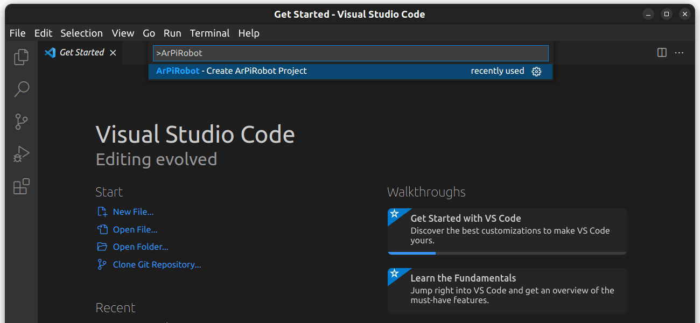
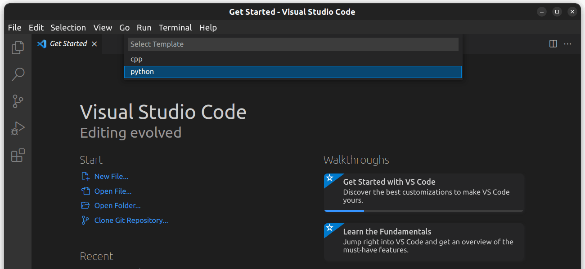
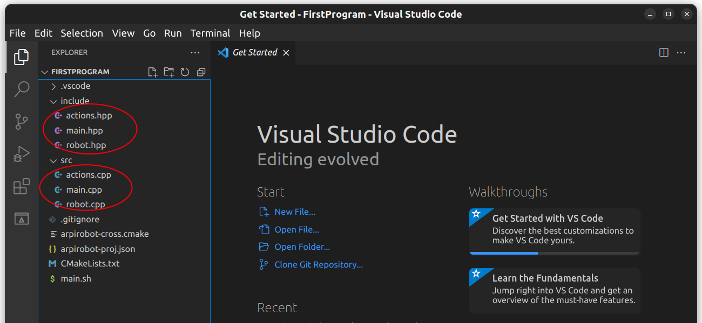
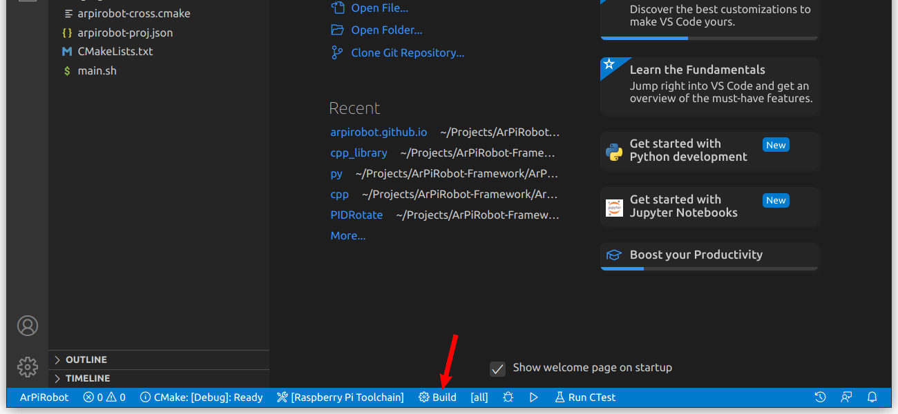
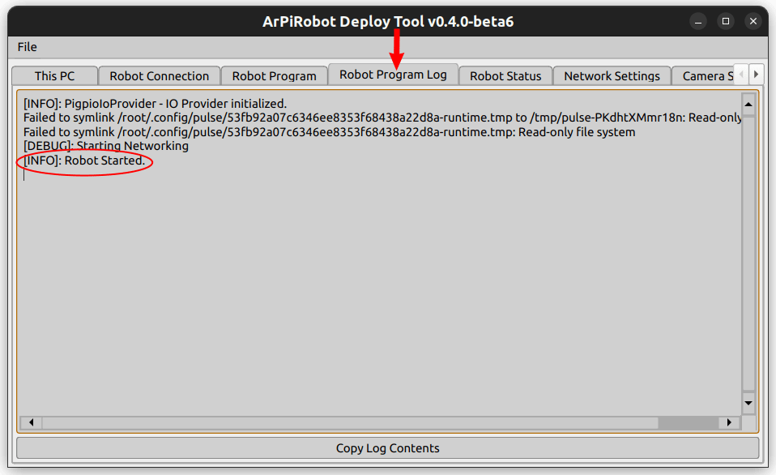

# First Program

## Creating a New Project

A project is a collection of code files that makeup one robot program. A new project can be created using VSCode with the ArPiRobot extension installed. When VSCode is opened there will be an `ArPiRobot` button along the bottom toolbar.

{: style="height:300px"}

After clicking this button a menu will open with an option to create an ArPiRobot project. Click this option.

{: style="height:300px"}

After clicking this option you will be prompted to choose a programming language. Choose the language you plan to use.

{: style="height:300px"}

Once the language has been selected enter the project name. The project name is your choice. In this case, `FirstProgram` would be a good choice. 

{: style="height:300px"}

Finally, choose a location to create the project. If in doubt, use your `Documents` folder.

{: style="height:300px"}

Each project has its own folder which will be created in the location selected. The folder name is the same as the project name. For example, if your project is named `FirstProgram` and the parent directory is `Documents` the project will be `Documents/FirstProgram`.

{: style="height:300px"}

Once the project has been created it will be opened in VSCode. If you want to open the same project later open VSCode and use the `File > Open Folder` option (or just `File > Open...` on macOS) to open the project's folder. The project will be created with several files, described below.

If you generated a C++ project you will be prompted to "configure" the project when you open it. Click yes to configure the project. If prompted to select a kit choose "Raspberry Pi Toolchain"

=== "Python Project Files"
    A Python project is generated with several source (`.py`) files in a folder named `src`. The other files generated are either used on the robot to start the program or used by the deploy tool to deploy the project.

    {: style="height:300px"}

=== "C++ Project Files"
    A C++ project is generated with several source (`.cpp`) files in a folder named `src` and headers (`.hpp`) in a folder named `include`. The other files generated are used on the robot to start the program, used by the deploy tool to deploy the project, or are part of the build system.

    {: style="height:300px"}

## Deploying to Robot

The project is created with a minimal amount of code to make it a valid robot program. As such, it can be deployed to the robot immediately to verify it runs and to learn how to deploy code.

Before deploying a project it is sometimes necessary to "build" the project. In simple terms "building" means taking the source code and translating it into a form that can be run. What exactly this process entails and whether it is necessary depends on the programming language.

=== "Python"
    Python projects do not need to be "built". The source code is deployed directly.

=== "C++"
    C++ projects must be built before they can be deployed. Before building, select the Raspberry Pi Toolchain "kit" for CMake in VSCode. If you do not see this option, the project is not "configured". Press `Ctrl+Shift+P` (`Cmd+Shift+P` on macOS) and type "CMake: Configure" and run that command. The pictured options should then be on the bottom toolbar.

    {: style="height:300px"}

    Then click the build button to build the project. A window will open with build output. It should build with no errors.

    {: style="height:300px"}

After building, deploying to the robot is done using the Deploy Tool. First, connect your computer to the robot's WiFi network (the robot will of course need to be powered on). After this is done open the Deploy Tool and click the "Connect" button.

{: style="height:300px"}

Next select the Robot Program tab. In this tab click the three dots button and choose the folder for the project. Finally, click the deploy button. The Deploy Tool will then perform several tasks to deploy the program. No errors should be reported.

{: style="height:300px"}

Once the program has been deployed select the "Robot Program Log" tab. You should see some output similar to the following. The "robot started line" indicates that the robot program has started successfully.

{: style="height:300px"}

## Periodic Functions

TODO: Explain the periodic programming model and add some custom log messages.

## Next Steps

TODO: Other parts of this guide can be followed and build on each other to create more complex code. Alternatively, can create new projects for each or those followed. Each will provide initial code assumed to be used.
