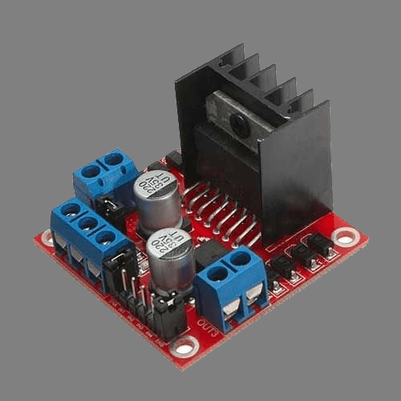

# Moving Motors

One of the most important devices on a robot are the motors. Controlling the motors allows your robot to perform many tasks, one of the most basic and essential of which is driving. This section will cover different motor controller options and writing code to control the motors.


## Motor Controllers

Many different motor controllers are supported by the ArPiRobot framework. Each one requires slightly different code to use. The ArPiRobot framework is object oriented, meaning your program will have one object for each motor on your robot, and sometimes one for the motor controller itself. The objects for the motors all have the same set of functions, but must be created differently based on the motor controller in use. This section covers creating the objects for the motors depending on which motor controller you use on your robot. The following section shows how to use the motor objects. Use of the motor objects is the same regardless of which motor type. In this section, you need only add the code for the motor controller you use on your robot.


??? "DRV8833 Motor Controller"

    {: style="height: 300px"}
    
    *Image Credit: [Adafruit](https://www.adafruit.com/product/3297)*

    The DRV8833 motor controller is a PWM driven motor controller chip capable of controlling two motors. The module pictured above is Adafruit's DRV8833 breakout board. Battery power is input using the terminal block (labeled Vmotor), motors are connected to Aout pins and Bout pins, and several I/O pins from the Raspberry Pi are connected to the control pins opposite the Aout and Bout pins. The Ain pins are used to control motor A and the Bin pins are used to controller motor B. The SLP (sleep) pin is used to enable / disable sleep mode on the entire controller. When in sleep mode, neither motor will respond. As such, it is necessary to make the following connections to the Raspberry Pi

    | DRV8833 Pin | Raspberry Pi Pin  |
    | ----------- | ----------------- |
    | Ain1        | Any GPIO (eg. 23) |
    | Ain2        | Any GPIO (eg. 24) |
    | SLP         | Any GPIO (eg. 25) |
    | Bin1        | Any GPIO (eg. 17) |
    | Bin2        | Any GPIO (eg. 27) |
    | GND         | AnyGND&ast;       |

    &ast; This only needs to be connected on one motor controller if multiple are used on the robot. This ensures that motor battery GND (usually AA batteries) and robot power GND (usually a USB battery pack) are connected. This is important for some sensors.

    Each control pin (all but GND) must use a different GPIO. As such, 5 GPIO pins are needed per DRV8833 module. In the robot code, an object is constructed for the DRV8833 module. This object for the module constructs objects for both motors (A and B). This object is constructed using the pin numbers (broadcom pin numbering). Pinout and pin numbers can be found at [pinout.xyz](https://pinout.xyz/). You can choose any 5 GPIO pins. This pinout also shows which pins on the Pi are GND pins.

    === "Python (`robot.py`)"
        ```py
        from arpirobot.core.robot import BaseRobot
        from arpirobot.core.log import Logger
        from arpirobot.core.action import ActionManager
        from arpirobot.core.network import NetworkTable

        # Import devices and other things here

        # ADDED: Imports for DRV8833
        from arpirobot.devices.drv8833 import DRV8833Module

        # Import actions here
        # from actions import ...

        class Robot(BaseRobot):
            def __init__(self):
                # Do not remove this line
                super().__init__()

                # Create devices and constants as member variables here
                # self.device_var = DeviceClass(args)

                # ADDED: Creation of DRV8833 module and motor variables
                # Duplicate this code for each DRV8833 in use, but use different
                # variable names. When constructing DRV8833Module arguments are pin
                # numbers in order Ain1, Ain2, Bin1, Bin2, SLP
                self.drv8833 = DRV8833Module(23, 24, 17, 27, 25)
                self.lmotor = self.drv8833.get_motor_a()
                self.rmotor = self.drv8833.get_motor_b()

                # Only create the devices here. Do not configure them here!
            
            def robot_started(self):
                # Run once when the robot starts
                # Configure devices here
                pass

            def robot_enabled(self):
                # Runs once each time the robot becomes enabled
                pass

            def robot_disabled(self):
                # Runs once each time the robot becomes disabled
                pass

            def enabled_periodic(self):
                # Runs periodically while the robot is enabled
                pass

            def disabled_periodic(self):
                # Runs periodically while the robot is disabled
                pass

            def periodic(self):
                # Runs periodically (regardless of robot state)

                # Do not remove this line or some devices will be disabled
                self.feed_watchdog()
        ```

    === "C++ (`robot.hpp`)"
        ```cpp
        #pragma once

        #include <arpirobot/core/robot/BaseRobot.hpp>

        #include <actions.hpp>

        // Other includes (for devices and other objects) here

        // ADDED: Includes for DRV8833
        #include <arpirobot/devices/drv8833/DRV8833Module.hpp>
        #include <arpirobot/devices/drv8833/DRV8833Motor.hpp>


        using namespace arpirobot;


        class Robot : public BaseRobot{
        public:
            
            // ADDED: Declare constructor (if this does not already exist)
            Robot();

            // Run when the robot starts
            void robotStarted();

            // Runs once each time the robot becomes enabled
            void robotEnabled();

            // Runs once each time the robot becomes disabled
            void robotDisabled();

            // Runs periodically while the robot is enabled
            void enabledPeriodic();

            // Runs periodically while the robot is disabled
            void disabledPeriodic();

            // Runs periodically (regardless of robot state)
            void periodic();


            // Add devices and constants here as member objects
            // These should be public so actions can access them using Main::robot

            // ADDED: Creation of DRV8833 module and motor variables
            // Duplicate this code for each DRV8833 in use, but use different
            // variable names.
            DRV8833Module drv8833;
            DRV8833Motor &motorA;
            DRV8833Motor &motorB;
        };
        ```

    === "C++ (`robot.cpp`)"
        ```cpp
        #include <robot.hpp>

        #include <arpirobot/core/log/Logger.hpp>
        #include <arpirobot/core/action/ActionManager.hpp>
        #include <arpirobot/core/network/NetworkTable.hpp>

        using namespace arpirobot;

        // ADDED: Constructor with initializer list for DRV8833 module and motors
        // Add new entries to initializer list for each DRV8833 in use. When 
        // constructing DRV8833Module arguments are pin numbers in order Ain1, Ain2, 
        // Bin1, Bin2, SLP
        Robot::Robot() : drv8833(23, 24, 17, 27, 25), 
                        motorA(drv8833.getMotorA()), 
                        motorB(drv8833.getMotorB()){

        }

        void Robot::robotStarted(){
            
        }

        void Robot::robotEnabled(){
            
        }

        void Robot::robotDisabled(){
            
        }

        void Robot::enabledPeriodic(){

        }

        void Robot::disabledPeriodic(){

        }

        void Robot::periodic(){
            // Do not remove this line or some devices will be disabled.
            feedWatchdog();
        }
        ```
  

??? "TB6612 Motor Controller"

    {: style="height: 300px"}

    *Image Credit: [Adafruit](https://www.adafruit.com/product/2448)*

  

??? "L298N Motor Controller"

    {: style="height: 300px"}

    *Image Credit: [Link](https://www.instructables.com/L298N-MOTOR-DRIVER-MODULE/)*

    TODO: Code & Explanation

  

??? "Adafruit Motor Hat / Bonnet"

    *Note: The Geekworm motor hat uses the same code as the Adafruit Motor Hat.*

    {: style="height: 300px"}

    *Image Credit: [Adafruit](https://www.adafruit.com/product/2348)*

    TODO: Code & Explanation


## Moving the Motors

TODO: Note that only works if robot enabled


### Motor Speed & Direction

TODO: Explain inverting directions both in hardware and software. Explain process for getting all motors to spin such that positive is forward.


### Brake Mode & Coast Mode

TODO: Default to coast. Show code to put in brake mode and show effects.

