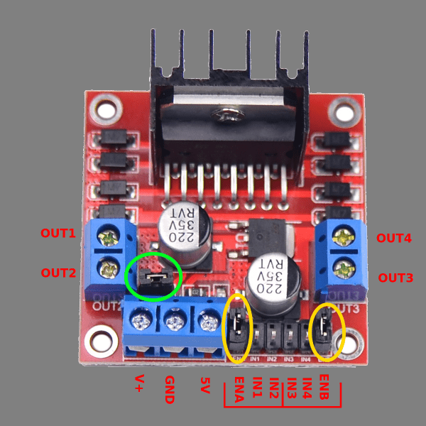

# Moving Motors

One of the most important devices on a robot are the motors. Controlling the motors allows your robot to perform many tasks, one of the most basic and essential of which is driving. This section will cover different motor controller options and writing code to control the motors.


## Motor Controllers

Many different motor controllers are supported by the ArPiRobot framework. Each one requires slightly different code to use. The ArPiRobot framework is object oriented, meaning your program will have one object for each motor on your robot, and sometimes one for the motor controller itself. The objects for the motors all have the same set of functions, but must be created differently based on the motor controller in use. This section covers creating the objects for the motors depending on which motor controller you use on your robot. The following section shows how to use the motor objects. Use of the motor objects is the same regardless of which motor type. In this section, you need only add the code for the motor controller you use on your robot.


??? "DRV8833 Motor Controller"

    {: style="height: 300px"}
    
    *Image Credit: [Adafruit](https://www.adafruit.com/product/3297)*

    The DRV8833 motor controller is a PWM driven motor controller chip capable of controlling two motors. The module pictured above is Adafruit's DRV8833 breakout board. Battery power is input using the terminal block (labeled Vmotor), motors are connected to Aout pins and Bout pins, and several I/O pins from the Raspberry Pi are connected to the control pins opposite the Aout and Bout pins. The Ain pins are used to control motor A and the Bin pins are used to controller motor B. The SLP (sleep) pin is used to enable / disable sleep mode on the entire controller. When in sleep mode, neither motor will respond. As such, it is necessary to make the following connections to the Raspberry Pi

    | DRV8833 Pin | Raspberry Pi Pin  |
    | ----------- | ----------------- |
    | Ain1        | Any GPIO (eg. 23) |
    | Ain2        | Any GPIO (eg. 24) |
    | SLP         | Any GPIO (eg. 25) |
    | Bin1        | Any GPIO (eg. 17) |
    | Bin2        | Any GPIO (eg. 27) |
    | GND         | Any GND&ast;      |

    &ast; This only needs to be connected on one motor controller if multiple are used on the robot. This ensures that motor battery GND (usually AA batteries) and robot power GND (usually a USB battery pack) are connected. This is important for some sensors.

    Each control pin (all but GND) must use a different GPIO. As such, 5 GPIO pins are needed per DRV8833 module. In the robot code, an object is constructed for the DRV8833 module. This object for the module constructs objects for both motors (A and B). This object is constructed using the pin numbers (broadcom pin numbering). Pinout and pin numbers can be found at [pinout.xyz](https://pinout.xyz/). You can choose any 5 GPIO pins. This pinout also shows which pins on the Pi are GND pins.

    An object for the DRV8833 module and both of its motors can be used in robot code as shown below

    === "Python (`robot.py`)"
        ```py
        from arpirobot.core.robot import BaseRobot
        from arpirobot.core.log import Logger
        from arpirobot.core.action import ActionManager
        from arpirobot.core.network import NetworkTable

        # Import devices and other things here

        # ADDED: Imports for DRV8833
        from arpirobot.devices.drv8833 import DRV8833Module

        # Import actions here
        # from actions import ...

        class Robot(BaseRobot):
            def __init__(self):
                # Do not remove this line
                super().__init__()

                # Create devices and constants as member variables here
                # self.device_var = DeviceClass(args)

                # ADDED: Creation of DRV8833 module and motor variables
                # Duplicate this code for each DRV8833 in use, but use different
                # variable names. When constructing DRV8833Module arguments are pin
                # numbers in order Ain1, Ain2, Bin1, Bin2, SLP
                self.drv8833 = DRV8833Module(23, 24, 17, 27, 25)
                self.motor_a = self.drv8833.get_motor_a()
                self.motor_b = self.drv8833.get_motor_b()

                # Only create the devices here. Do not configure them here!
            
            def robot_started(self):
                # Run once when the robot starts
                # Configure devices here
                pass

            def robot_enabled(self):
                # Runs once each time the robot becomes enabled
                pass

            def robot_disabled(self):
                # Runs once each time the robot becomes disabled
                pass

            def enabled_periodic(self):
                # Runs periodically while the robot is enabled
                pass

            def disabled_periodic(self):
                # Runs periodically while the robot is disabled
                pass

            def periodic(self):
                # Runs periodically (regardless of robot state)

                # Do not remove this line or some devices will be disabled
                self.feed_watchdog()
        ```

    === "C++ (`robot.hpp`)"
        ```cpp
        #pragma once

        #include <arpirobot/core/robot/BaseRobot.hpp>

        #include <actions.hpp>

        // Other includes (for devices and other objects) here

        // ADDED: Includes for DRV8833
        #include <arpirobot/devices/drv8833/DRV8833Module.hpp>
        #include <arpirobot/devices/drv8833/DRV8833Motor.hpp>


        using namespace arpirobot;


        class Robot : public BaseRobot{
        public:
            
            // ADDED: Declare constructor (if this does not already exist)
            Robot();

            // Run when the robot starts
            void robotStarted();

            // Runs once each time the robot becomes enabled
            void robotEnabled();

            // Runs once each time the robot becomes disabled
            void robotDisabled();

            // Runs periodically while the robot is enabled
            void enabledPeriodic();

            // Runs periodically while the robot is disabled
            void disabledPeriodic();

            // Runs periodically (regardless of robot state)
            void periodic();


            // Add devices and constants here as member objects
            // These should be public so actions can access them using Main::robot

            // ADDED: Creation of DRV8833 module and motor variables
            // Duplicate this code for each DRV8833 in use, but use different
            // variable names.
            DRV8833Module drv8833;
            DRV8833Motor &motorA;
            DRV8833Motor &motorB;
        };
        ```

    === "C++ (`robot.cpp`)"
        ```cpp
        #include <robot.hpp>

        #include <arpirobot/core/log/Logger.hpp>
        #include <arpirobot/core/action/ActionManager.hpp>
        #include <arpirobot/core/network/NetworkTable.hpp>

        using namespace arpirobot;

        // ADDED: Constructor with initializer list for DRV8833 module and motors
        // Add new entries to initializer list for each DRV8833 in use. When 
        // constructing DRV8833Module arguments are pin numbers in order Ain1, Ain2, 
        // Bin1, Bin2, SLP
        Robot::Robot() : drv8833(23, 24, 17, 27, 25), 
                        motorA(drv8833.getMotorA()), 
                        motorB(drv8833.getMotorB()){

        }

        void Robot::robotStarted(){
            
        }

        void Robot::robotEnabled(){
            
        }

        void Robot::robotDisabled(){
            
        }

        void Robot::enabledPeriodic(){

        }

        void Robot::disabledPeriodic(){

        }

        void Robot::periodic(){
            // Do not remove this line or some devices will be disabled.
            feedWatchdog();
        }
        ```
  

??? "TB6612 Motor Controller"

    {: style="height: 300px"}

    *Image Credit: [Adafruit](https://www.adafruit.com/product/2448)*

    The TB6612 motor controller is a PWM driven motor controller chip capable of controlling two motors. The module pictured above is Adafruit's TB6612 breakout board. Battery power is input using the terminal block (labeled Vmotor), motors are connected to MotorA pins and MotorB pins, and several I/O pins from the Raspberry Pi are connected to the control pins opposite the MotorA and MotorB pins. The Ain pins and PwmA are used to control motor A and the Bin pins and PwmB are used to controller motor B.  As such, it is necessary to make the following connections to the Raspberry Pi

    | TB6612 Pin  | Raspberry Pi Pin  |
    | ----------- | ----------------- |
    | Ain1        | Any GPIO (eg. 23) |
    | Ain2        | Any GPIO (eg. 24) |
    | PwmA        | Any GPIO (eg. 25) |
    | Bin1        | Any GPIO (eg. 17) |
    | Bin2        | Any GPIO (eg. 27) |
    | PwmB        | Any GPIO (eg. 22) |
    | GND         | Any GND&ast;      |

    &ast; This only needs to be connected on one motor controller if multiple are used on the robot. This ensures that motor battery GND (usually AA batteries) and robot power GND (usually a USB battery pack) are connected. This is important for some sensors.

    Each control pin (all but GND) must use a different GPIO. As such, 6 GPIO pins are needed per TB6612 module. In the robot code, an object is constructed for the TB6612 module. This object for the module constructs objects for both motors (A and B). This object is constructed using the pin numbers (broadcom pin numbering). Pinout and pin numbers can be found at [pinout.xyz](https://pinout.xyz/). You can choose any 6 GPIO pins. This pinout also shows which pins on the Pi are GND pins.

    An object for the TB6612 module and both of its motors can be used in robot code as shown below

    === "Python (`robot.py`)"
        ```py
        from arpirobot.core.robot import BaseRobot
        from arpirobot.core.log import Logger
        from arpirobot.core.action import ActionManager
        from arpirobot.core.network import NetworkTable

        # Import devices and other things here

        # ADDED: Imports for TB6612
        from arpirobot.devices.tb6612 import TB6612Module

        # Import actions here
        # from actions import ...

        class Robot(BaseRobot):
            def __init__(self):
                # Do not remove this line
                super().__init__()

                # Create devices and constants as member variables here
                # self.device_var = DeviceClass(args)

                # ADDED: Creation of TB6612 module and motor variables
                # Duplicate this code for each TB6612 in use, but use different
                # variable names. When constructing TB6612Module arguments are pin
                # numbers in order Ain1, Ain2, PwmA, Bin1, Bin2, PwmB
                self.tb6612 = TB6612Module(23, 24, 25, 17, 27, 22)
                self.motor_a = self.tb6612.get_motor_a()
                self.motor_b = self.tb6612.get_motor_b()

                # Only create the devices here. Do not configure them here!
            
            def robot_started(self):
                # Run once when the robot starts
                # Configure devices here
                pass

            def robot_enabled(self):
                # Runs once each time the robot becomes enabled
                pass

            def robot_disabled(self):
                # Runs once each time the robot becomes disabled
                pass

            def enabled_periodic(self):
                # Runs periodically while the robot is enabled
                pass

            def disabled_periodic(self):
                # Runs periodically while the robot is disabled
                pass

            def periodic(self):
                # Runs periodically (regardless of robot state)

                # Do not remove this line or some devices will be disabled
                self.feed_watchdog()
        ```

    === "C++ (`robot.hpp`)"
        ```cpp
        #pragma once

        #include <arpirobot/core/robot/BaseRobot.hpp>

        #include <actions.hpp>

        // Other includes (for devices and other objects) here

        // ADDED: Includes for TB6612
        #include <arpirobot/devices/tb6612/TB6612Module.hpp>
        #include <arpirobot/devices/tb6612/TB6612Motor.hpp>


        using namespace arpirobot;


        class Robot : public BaseRobot{
        public:
            
            // ADDED: Declare constructor (if this does not already exist)
            Robot();

            // Run when the robot starts
            void robotStarted();

            // Runs once each time the robot becomes enabled
            void robotEnabled();

            // Runs once each time the robot becomes disabled
            void robotDisabled();

            // Runs periodically while the robot is enabled
            void enabledPeriodic();

            // Runs periodically while the robot is disabled
            void disabledPeriodic();

            // Runs periodically (regardless of robot state)
            void periodic();


            // Add devices and constants here as member objects
            // These should be public so actions can access them using Main::robot

            // ADDED: Creation of TB6612 module and motor variables
            // Duplicate this code for each TB6612 in use, but use different
            // variable names.
            TB6612Module tb6612;
            TB6612Motor &motorA;
            TB6612Motor &motorB;
        };
        ```

    === "C++ (`robot.cpp`)"
        ```cpp
        #include <robot.hpp>

        #include <arpirobot/core/log/Logger.hpp>
        #include <arpirobot/core/action/ActionManager.hpp>
        #include <arpirobot/core/network/NetworkTable.hpp>

        using namespace arpirobot;

        // ADDED: Constructor with initializer list for TB6612 module and motors
        // Add new entries to initializer list for each TB6612 in use. When 
        // constructing TB6612Module arguments are pin numbers in order Ain1, Ain2, 
        // PwmA, Bin1, Bin2, PwmB
        Robot::Robot() : tb6612(23, 24, 25, 17, 27, 22), 
                        motorA(tb6612.getMotorA()), 
                        motorB(tb6612.getMotorB()){

        }

        void Robot::robotStarted(){
            
        }

        void Robot::robotEnabled(){
            
        }

        void Robot::robotDisabled(){
            
        }

        void Robot::enabledPeriodic(){

        }

        void Robot::disabledPeriodic(){

        }

        void Robot::periodic(){
            // Do not remove this line or some devices will be disabled.
            feedWatchdog();
        }
        ```

  

??? "L298N Motor Controller"

    {: style="height: 300px"}

    The L298N motor controller is a PWM driven motor controller chip capable of controlling two motors. The module pictured above is a common breakout board / module using the L298N chip. Battery power is input using the V+ and GND pins. The 5V pin should have nothing connected to it generally. The 5V pin is used to supply 5V power if the input voltage (between V+ and GND) exceeds 12V. If the input voltage exceeds 12V disconnect the jumper for the builtin 5V regulator (circled in green) and supply 5V power from elsewhere (Pi, Arduino, etc). The L298N module supports two motors. Motor A is connected to OUT1 and OUT2. Motor B is connected to OUT3 and OUT4. The pins in the bottom right area of the module are connected to the Pi to control both motors. The IN1, IN2, and ENA control motor A and IN3, IN4, and ENB control motor B. Often the EN pins have a jumper connecting them to 5V. Remove these jumpers (circled in yellow) as the ENA and ENB pins will be connected to the Pi instead. The following connections should be made between the L298N module and the Pi

    | L298N Pin   | Raspberry Pi Pin  |
    | ----------- | ----------------- |
    | IN1         | Any GPIO (eg. 23) |
    | IN2         | Any GPIO (eg. 24) |
    | ENA         | Any GPIO (eg. 25) |
    | IN3         | Any GPIO (eg. 17) |
    | IN4         | Any GPIO (eg. 27) |
    | ENB         | Any GPIO (eg. 22) |
    | GND         | Any GND&ast;      |

    &ast; This only needs to be connected on one motor controller if multiple are used on the robot. This ensures that motor battery GND (usually AA batteries) and robot power GND (usually a USB battery pack) are connected. This is important for some sensors.

    Each control pin (all but GND) must use a different GPIO. As such, 6 GPIO pins are needed per L298N module. In the robot code, an object is constructed for the L298N module. This object for the module constructs objects for both motors (A and B). This object is constructed using the pin numbers (broadcom pin numbering). Pinout and pin numbers can be found at [pinout.xyz](https://pinout.xyz/). You can choose any 6 GPIO pins. This pinout also shows which pins on the Pi are GND pins.

    An object for the L298N module and both of its motors can be used in robot code as shown below

    === "Python (`robot.py`)"
        ```py
        from arpirobot.core.robot import BaseRobot
        from arpirobot.core.log import Logger
        from arpirobot.core.action import ActionManager
        from arpirobot.core.network import NetworkTable

        # Import devices and other things here

        # ADDED: Imports for L298N
        from arpirobot.devices.l298n import L298NModule

        # Import actions here
        # from actions import ...

        class Robot(BaseRobot):
            def __init__(self):
                # Do not remove this line
                super().__init__()

                # Create devices and constants as member variables here
                # self.device_var = DeviceClass(args)

                # ADDED: Creation of L298N module and motor variables
                # Duplicate this code for each L298N in use, but use different
                # variable names. When constructing L298NModule arguments are pin
                # numbers in order IN1, IN2, ENA, IN3, IN4, ENB
                self.l298n = L298NModule(23, 24, 25, 17, 27, 22)
                self.motor_a = self.l298n.get_motor_a()
                self.motor_b = self.l298n.get_motor_b()

                # Only create the devices here. Do not configure them here!
            
            def robot_started(self):
                # Run once when the robot starts
                # Configure devices here
                pass

            def robot_enabled(self):
                # Runs once each time the robot becomes enabled
                pass

            def robot_disabled(self):
                # Runs once each time the robot becomes disabled
                pass

            def enabled_periodic(self):
                # Runs periodically while the robot is enabled
                pass

            def disabled_periodic(self):
                # Runs periodically while the robot is disabled
                pass

            def periodic(self):
                # Runs periodically (regardless of robot state)

                # Do not remove this line or some devices will be disabled
                self.feed_watchdog()
        ```

    === "C++ (`robot.hpp`)"
        ```cpp
        #pragma once

        #include <arpirobot/core/robot/BaseRobot.hpp>

        #include <actions.hpp>

        // Other includes (for devices and other objects) here

        // ADDED: Includes for L298N
        #include <arpirobot/devices/l298n/L298NModule.hpp>
        #include <arpirobot/devices/l298n/L298NMotor.hpp>


        using namespace arpirobot;


        class Robot : public BaseRobot{
        public:
            
            // ADDED: Declare constructor (if this does not already exist)
            Robot();

            // Run when the robot starts
            void robotStarted();

            // Runs once each time the robot becomes enabled
            void robotEnabled();

            // Runs once each time the robot becomes disabled
            void robotDisabled();

            // Runs periodically while the robot is enabled
            void enabledPeriodic();

            // Runs periodically while the robot is disabled
            void disabledPeriodic();

            // Runs periodically (regardless of robot state)
            void periodic();


            // Add devices and constants here as member objects
            // These should be public so actions can access them using Main::robot

            // ADDED: Creation of L298N module and motor variables
            // Duplicate this code for each L298N in use, but use different
            // variable names.
            L298NModule l298n;
            L298NMotor &motorA;
            L298NMotor &motorB;
        };
        ```

    === "C++ (`robot.cpp`)"
        ```cpp
        #include <robot.hpp>

        #include <arpirobot/core/log/Logger.hpp>
        #include <arpirobot/core/action/ActionManager.hpp>
        #include <arpirobot/core/network/NetworkTable.hpp>

        using namespace arpirobot;

        // ADDED: Constructor with initializer list for L298N module and motors
        // Add new entries to initializer list for each L298N in use. When 
        // constructing L298NModule arguments are pin numbers in order IN1, IN2, 
        // ENA, IN3, IN4, ENB
        Robot::Robot() : l298n(23, 24, 25, 17, 27, 22), 
                        motorA(l298n.getMotorA()), 
                        motorB(l298n.getMotorB()){

        }

        void Robot::robotStarted(){
            
        }

        void Robot::robotEnabled(){
            
        }

        void Robot::robotDisabled(){
            
        }

        void Robot::enabledPeriodic(){

        }

        void Robot::disabledPeriodic(){

        }

        void Robot::periodic(){
            // Do not remove this line or some devices will be disabled.
            feedWatchdog();
        }
        ```

  

??? "Adafruit Motor Hat / Bonnet"

    *Note: The Geekworm motor hat uses the same code as the Adafruit Motor Hat.*

    {: style="height: 300px"}

    *Image Credit: [Adafruit](https://www.adafruit.com/product/2348)*

    Adafruit's motor hat / bonnet are connected to the Pi's GPIO header. The hat covers the entire header, although most pins are not used by the hat. As such, if the hat / bonnet is assembled using stacking headers (highly recommended) many GPIO pins are still accessible for other purposes. Additionally, the hat has a row of pads that headers can be soldered on to to access GPIO pins. This row of headers is directly below the header used to connect to the Pi.

    Unlike most other motor controllers, the motor hat does not require the Pi generate PWM signals. Instead the motor hat includes its own PWM driver that communicates with the Pi via I2C. This is often better as the Pi generates PWM signals using software. The motor hat also supports four motors.

    In addition to connecting the motor hat to the Pi, it is necessary to connect motors and battery power to the hat. Battery power is connected to the two-pin terminal block header in the bottom right (labeled "+" and "-"). The motor hat itself connects "-" (battery GND) and GND on the Pi, so no additional ground connections are needed. The motors are connected to the ports labeled M1, M2, M3, and M4. If using the Geekworm motor hat, the code will not use the numbering order printed on the hat (by default). It will instead use the same physical ordering as the Adafruit hat (far left is M1, then M2, then M3, then M4). This can be disabled if desired, but improves compatibility between the two hats.

    Once connected, the following code can be used to access each motor on the hat

    === "Python (`robot.py`)"
        ```py
        from arpirobot.core.robot import BaseRobot
        from arpirobot.core.log import Logger
        from arpirobot.core.action import ActionManager
        from arpirobot.core.network import NetworkTable

        # Import devices and other things here

        # ADDED: Imports for Adafruit Motor Hat
        from arpirobot.devices.adafruitmotorhat import AdafruitMotorHatMotor

        # Import actions here
        # from actions import ...

        class Robot(BaseRobot):
            def __init__(self):
                # Do not remove this line
                super().__init__()

                # Create devices and constants as member variables here
                # self.device_var = DeviceClass(args)

                # ADDED: Creation of AdafruitMotorHatMotor for each of 4 motors
                # When creating motors, I2C address of the hat can be specified
                # as an optional second argument. If not specified, it will try the
                # default address of the Adafruit hat. If that fails it will try
                # the default address of the Geekworm hat. If your motor hat is
                # not using the default address, it must be specified.
                # There is also an optional third argument which can be set to false
                # to disable the "remapping" of Geekworm hat motors to match the 
                # Adafruit hat layout
                # self.my_motor = AdafruitMotorHatMotor(motor_num, hat_addr, remap)
                self.motor1 = AdafruitMotorHatMotor(1)
                self.motor2 = AdafruitMotorHatMotor(2)
                self.motor3 = AdafruitMotorHatMotor(3)
                self.motor4 = AdafruitMotorHatMotor(4)

                # Only create the devices here. Do not configure them here!
            
            def robot_started(self):
                # Run once when the robot starts
                # Configure devices here
                pass

            def robot_enabled(self):
                # Runs once each time the robot becomes enabled
                pass

            def robot_disabled(self):
                # Runs once each time the robot becomes disabled
                pass

            def enabled_periodic(self):
                # Runs periodically while the robot is enabled
                pass

            def disabled_periodic(self):
                # Runs periodically while the robot is disabled
                pass

            def periodic(self):
                # Runs periodically (regardless of robot state)

                # Do not remove this line or some devices will be disabled
                self.feed_watchdog()
        ```

    === "C++ (`robot.hpp`)"
        ```cpp
        #pragma once

        #include <arpirobot/core/robot/BaseRobot.hpp>

        #include <actions.hpp>

        // Other includes (for devices and other objects) here

        // ADDED: Includes for Adafruit Motor Hat
        #include <arpirobot/devices/adafruitmotorhat/AdafruitMotorHatMotor.hpp>


        using namespace arpirobot;


        class Robot : public BaseRobot{
        public:

            // Run when the robot starts
            void robotStarted();

            // Runs once each time the robot becomes enabled
            void robotEnabled();

            // Runs once each time the robot becomes disabled
            void robotDisabled();

            // Runs periodically while the robot is enabled
            void enabledPeriodic();

            // Runs periodically while the robot is disabled
            void disabledPeriodic();

            // Runs periodically (regardless of robot state)
            void periodic();


            // Add devices and constants here as member objects
            // These should be public so actions can access them using Main::robot

            // ADDED: Creation of AdafruitMotorHatMotor for each of 4 motors
            // When creating motors, I2C address of the hat can be specified
            // as an optional second argument. If not specified, it will try the
            // default address of the Adafruit hat. If that fails it will try
            // the default address of the Geekworm hat. If your motor hat is
            // not using the default address, it must be specified.
            // There is also an optional third argument which can be set to false
            // to disable the "remapping" of Geekworm hat motors to match the 
            // Adafruit hat layout
            // AdafruitMotorHatMotor myMotor {motor_num, hat_addr, remap};
            AdafruitMotorHatMotor motor1 {1};
            AdafruitMotorHatMotor motor2 {2};
            AdafruitMotorHatMotor motor3 {3};
            AdafruitMotorHatMotor motor4 {4};
        };
        ```


## Using the Motors

Once you have added motor objects to your robot program, they can all be used the same way (regardless of which motor controller you are using). The motor objects all share a common set of functions and features.


### Motor Speed & Direction

Motor speeds are represented as values between -1 and 1. The sign controls direction so -0.5 is 50% in the opposite direction of 0.5 (which is still 50% power). Whether negative is forward or reverse depends on several factors, which will be discussed later.

The following code show how to use a motor's `set_speed` (or `setSpeed` in C++) function to control a motor's speed. Replace the `robot_enabled` and `robot_disabled` functions in your progam with the following.

=== "Python (`robot.py`)"
    ```py
    def robot_enabled(self):
        self.motor1.set_speed(0.75)
    
    def robot_disabled(self):
        self.motor1.set_speed(0)
    ```

=== "C++ (`robot.cpp`)"
    ```cpp
    void robotEnabled(){
        motor1.setSpeed(0.75);
    }

    void robotDisabled(){
        motor1.setSpeed(0);
    }
    ```

The above code will set the motor called `motor1` to a speed of 75% when the robot is enabled. When disabled, the motor will be stopped by setting the speed to 0. Note that even if the speed were not set to zero, motors are still disabled and stopped when the robot is disabled. If needed, change the name of the motor from `motor1` to `motor_a` or `motorA` depending on what you named the motor in your code.

In the above example, a speed of positive 75% was used. Often it is desired to make positive forward for all motors. If your motor spins in reverse when you run the above code you have a few options. First, you could switch how the motor is connected. A motor has two wires (often a red and a black). Switching the order of the wires connected to the motor controller will reverse the motor direction. However, the motor direction can also be inverted in software. To invert the direction of `motor` add the following to `robot_started`

=== "Python (`robot.py`)"
    ```py
    def robot_started(self):
        # Add this line to robot_started
        self.motor1.set_inverted(True)
    ```

=== "C++ (`robot.cpp`)"
    ```cpp
    void robotStarted(){
        // Add this line to robotStarted
        motor1.setInverted(true);
    }
    ```


### Brake Mode & Coast Mode

In addition to setting speed and direction, motor controllers have one other common setting handling what happens when a motor is stopped (speed 0). When a motor is not moving it can either spin freely or it can attempt to resist motion. The latter is referred to as "brake mode". To enable brake mode for a motor add a line like the following to `robot_started`. Brake mode can be disabled later by using the same function, but replacing `True` with `False` (or `true` with `false`).

=== "Python (`robot.py`)"
    ```py
    def robot_started(self):
        # Add this line to robot_started
        self.motor1.set_brake_mode(True)
    ```

=== "C++ (`robot.cpp`)"
    ```cpp
    void robotStarted(){
        // Add this line to robotStarted
        motor1.setBrakeMode(true);
    }
    ```
