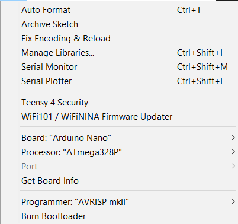
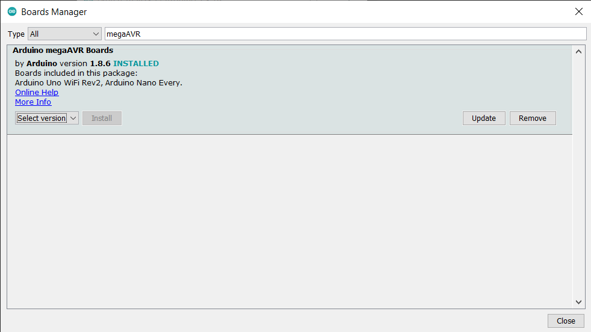
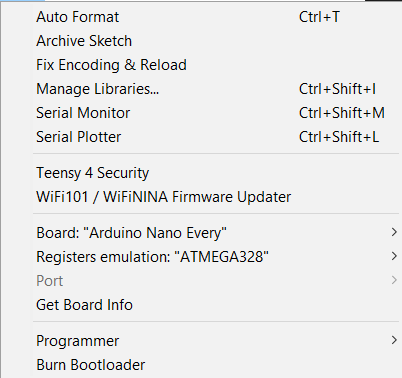
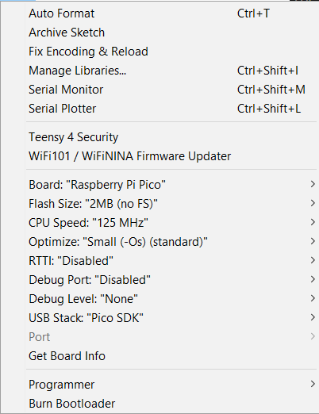
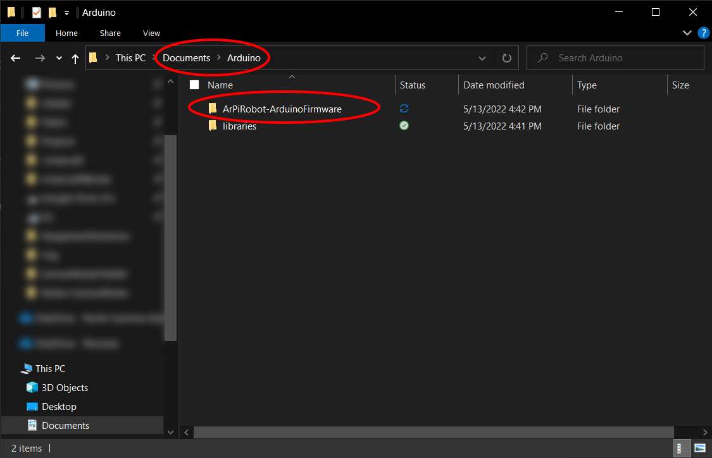
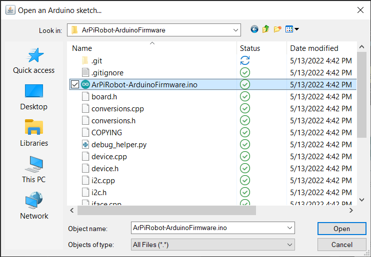
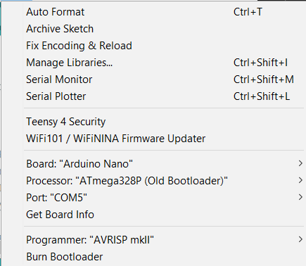
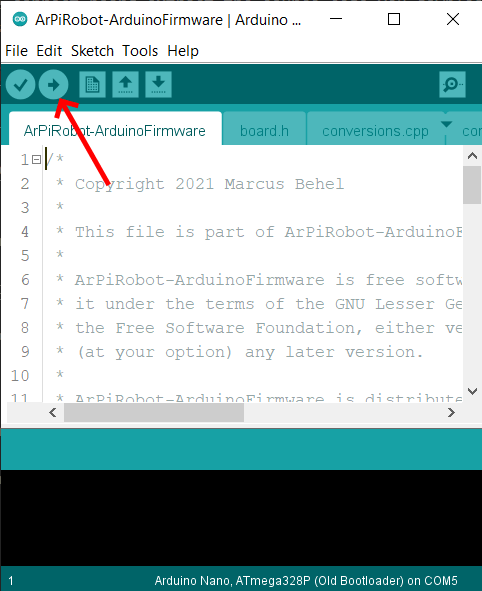
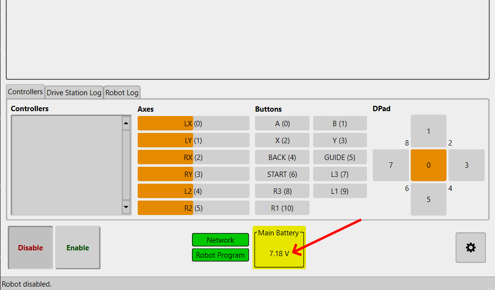
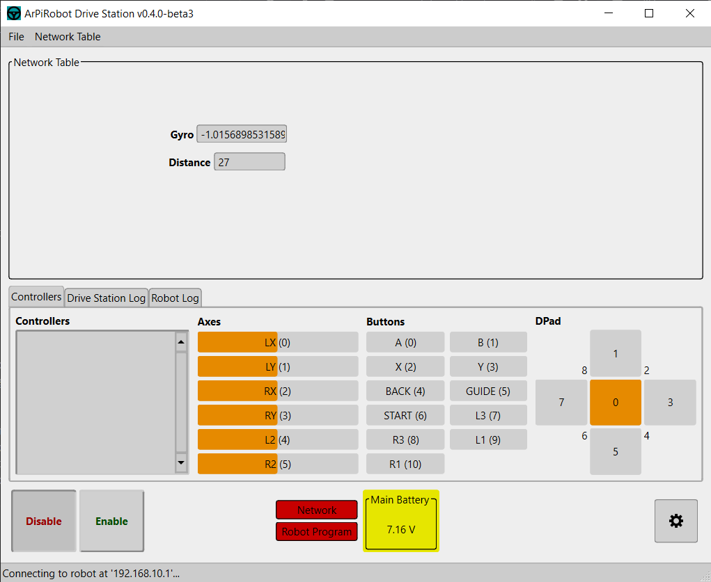

# Sensor Data & NetworkTable

Now that your robot can move around, it's time to add support for sensors. Sensors enable the robot to determine information about itself or the world around it. In this section, we will add support for measuring motor battery voltage, measuring distance to an object with an ultrasonic sensor, and measuring robot rotation using an IMU (gyroscope + accelerometer).

## Arduino Interface & Sensors

Many sensors do not work well with the Raspberry Pi directly. In some cases the Pi may lack support for certain functions (such as analog readings) or in other cases a Pi may not provide fine enough control over timing (a big issue for something like a gyroscope). Often, a microcontroller is better suited to working with sensors. Arduinos are microcontroller development boards. Being a development board, it contains extra circuitry needed to program the device and make it easy to interface with. This makes an Arduino an ideal device to use on the robot as a sensor *coprocessor*. The Arduino manages the sensors and collects the required data and sends it back to the Raspberry Pi where it can be used in the robot program. The Arduino communicates with the Pi using a UART (a Serial port) over USB. This allows the Arduino to be connected to the Pi and powered from the Pi by a USB cable.

### ArPiRobot Arduino Firmware

The ArPiRobot Arduino Firmware is a program written using the Arduino framework. This allows the firmware itself to support many different Arduino boards (and other microcontroller development boards too) using the same program. The source code for the firmware can be downloaded on the [downloads page](../../downloads/latest.md). To build the firmware and upload it to your board, you need to have the board and a USB cable to connect it to your computer. You also need to have the [Arduino IDE](https://www.arduino.cc/en/software) installed. Once installed, open the program.

Depending on your board you may also need to install a boards package to support your board in the Arduino IDE. Follow the instructions below for the board you are using. *Note: This may not include instructions for every supported board. Check the README on the [ArPiRobot Arduino Firmware GitHub](https://github.com/ArPiRobot/ArPiRobot-ArduinoFirmware) repo for more information about supported boards.*

??? "Arduino Nano & Clones"
    The Arduino Nano (and clones of the Arduino Nano) have support builtin to the Arduino IDE. Under the `Tools` menu change the board to "Arduino Nano" (under a category called `Arduino AVR Boards`). If you are using a clone (or an older nano) you probably need to change the `Processor` to `ATmega328P (Old Bootloader)`.

    {: style="height:250px"}

??? "Arduino Nano Every"
    The Arduino Nano Every is officially supported, but the `megaAVR` boards package must be installed first. Under `Tools > Board` open `Board Manger...`. Search `megaAVR` and install the `Arduino megaAVR Boards` package (latest version). 
    
    {: style="height:250px"}
    
    Then, close the boards manager and select `Arduino Nano Every` under `Tools > Board` (under the `Arduino megaAVR Boards` category).

    {: style="height:250px"}

??? "Raspberry Pi Pico"
    The Raspberry Pi Pico is supported by the ArPiRobot Arduino Firmware *using the [arduino-pico](https://github.com/earlephilhower/arduino-pico) core, **not** the official Mbed OS core*. Follow the [install instructions](https://arduino-pico.readthedocs.io/en/latest/install.html#installing-via-arduino-boards-manager) for `arduino-pico`. Then choose `Raspberry Pi Pico` under `Tools > Board` in the Arduino IDE. This will be under a category called `Raspberry Pi RP2040 Boards` **not** `Arduino Mbed OS RP2040 Boards`.

    {: style="height:250px"}

Once you've configured the correct board extract the source code you downloaded earlier to the `Arduino` folder that has been created in your `Documents` folder.

{: style="height:300px"}

Then in the Arduino IDE click `File > Open` and choose the extracted project. Open the `ArPiRobot-ArduinoFirmware.ino` file.

{: style="height:250px"}

Next install the required libraries for the firmware. These can be installed using the library manager by selecting `Tools > Manage Libraries...`. Search for and install the latest version of the `FastCRC` library.

Then, plug in your Arduino using the USB cable. You should now have a port listed under `Tools > Ports`. Select it (the number / name will likely not be the same as in the screenshot below).

{: style="height:200px"}

Finally, to build and upload the firmware to your board click the upload button (the arrow) along the top bar.

{: style="height:300px"}


### Connecting Sensors

*Specific information about how each sensor must be connected and how connections can be made is located in the "Building a Robot" section of the guide.*

<!--TODO: Add a link above instead of just naming the section once that part of the guide is written-->

Now that the board is programmed, it is time to disconnect it from your computer. Connect it to the Pi on the robot by USB cable.

The ArPiRobot Arduino Firmware is fairly simple and does not need to be modified before use. The firmware is built with support for various sensors, but it does not know how sensors are connected to the Arduino. This information is provided to the Arduino from the Pi by your robot program. As such, it is necessary to know what sensors are connected and how they are connected when writing the code for your sensors. In this section of the guide three sensors are used: a voltage monitor, an ultrasonic sensor, and an IMU (Inertial Measurement Unit) containing both a gyroscope (measures rotation) and an accelerometer (measures acceleration). The code is written assuming the sensors are connected to the Arduino as follows

**Voltage Monitor (Voltage Divider Module)**

| Voltage Monitor Pin | Arduino Pin          | Use                         |
| ------------------- | -------------------- | --------------------------- |
| S                   | A0                   | Voltage reading (S = signal; A0 = analog input 0). Any analog input could be used instead of A0. | 

**Ultrasonic Sensor (HC-SR04)**

| Ultrasonic Sensor Pin | Arduino Pin            | Use                                |
| --------------------- | ---------------------- | ---------------------------------- |
| TRIG                  | 7                      | TRIG = trigger pin. Arduino writes a pulse to this pin to start a distance measurement. Any digital input / output pin can be used. |
| ECHO                  | 8                      | ECHO = echo pin. Arduino reads a pulse back in response to the triggered pulse to measure distance. Any digital input / output pin can be used. |

**IMU (Mpu6050)**

| IMU PIN           | Arduino Pin              | Use                              |
| ----------------- | ------------------------ | -------------------------------- |
| SCL               | SCL                      | I2C clock. SCL pin on Arduino may be shared with another pin depending on your board. Search for your board's pinout to determine which pin. |
| SDA               | SDA                      | I2C data. SDA pin on Arduino may be shared with another pin depending on your board. Search for your board's pinout to determine which pin. |


The above information is provided to make clear the assumptions that were used when writing the code in the next section. You can change connections as desired, just make sure the connection is valid for the sensor and change the code appropriately.

Likewise, if you are using a different supported IMU, you may need to change connections (tough at the time of writing this all supported IMUs are I2C devices and connected the same way) and you will need to change the code to use the correct device. 

For more information on each supported sensor see the [Arduino Interface and Sensors](http://localhost:8000/ref/arduino/) section of the programming reference.


## The Robot Code

### Creating Arduino Interface

An Arduino Interface is an object used in robot code to represent a board running the ArPiRobot Arduino Firmware connected to the Pi on the robot. Currently, only UART is supported as a connection method, therefore the `ArduinoUartInterface` class will be used.

In order to setup UART communication with the Arduino two pieces of information are required: the name of the serial / UART of the device and the baud rate for UART communication. The baud rate must be the same on both the Arduino and the Pi. The ArPiRobot ArduinoFirmware uses a baud rate of `57600` (unless you modify it) so use this on the Pi as well. Determining which UART port is a little more difficult. In Windows serial ports are named `COM` followed by some number. On linux systems they are `/dev/tty[TYPE][NUMBER]`. For most Arduinos type will be `USB` (although it is `ACM` for some). Generally, since only one USB serial device will be connected to the Pi, the number will be `0` making the device `/dev/ttyUSB0`. This name will be used when creating the Arduino interface object as shown in the code below.

=== "Python (`robot.py`)"
    ```py
    # Add with the other imports at the top of the file
    from arpirobot.arduino.iface import ArduinoUartInterface

    # Add in __init__ under the other devices
    # (below motors, drive helper, etc)
    self.arduino = ArduinoUartInterface("/dev/ttyUSB0", 57600)
    ```

=== "C++ (`robot.hpp`)"
    ```cpp
    // Add with the other includes at the top of the file
    #include <arpirobot/arduino/iface/ArduinoUartInterface.hpp>

    // Add below the other devices at the bottom of the class declaration
    // (below motors, drive helper, etc)
    ArduinoUartInterface arduino { "/dev/ttyUSB0", 57600 };
    ```

Then, in `robot_started` / `robotStarted` add the following so the Pi begins communicating with the Arduino when your robot program starts.

=== "Python (`robot.py`)"
    ```py
    # Add at the end of robot_started
    self.arduino.begin()
    ```

=== "C++ (`robot.cpp`)"
    ```cpp
    // Add at the end of robotStarted
    arduino.begin();
    ```

Build and deploy the code to your robot. Look for some lines similar to the following in the robot program log (in Deploy Tool). This line will appear after the robot started message is logged.

```
[DEBUG]: ArduinoUartInterface(/dev/ttyUSB0, 57600) - Opened interface.
[DEBUG]: ArduinoUartInterface(/dev/ttyUSB0, 57600) - Arduino is ready. Creating devices.
[DEBUG]: ArduinoUartInterface(/dev/ttyUSB0, 57600) - Done creating devices. Starting sensor processing.
[DEBUG]: ArduinoUartInterface(/dev/ttyUSB0, 57600) - Sensor processing started successfully.
```

If you instead see a message similar to the following, the uart port name is probably wrong. Try `/dev/ttyACM0`.

```
[ERROR]: ArduinoUartInterface(/dev/ttyUCB0, 57600) - Unable to open arduino interface.
```


### Creating the Sensors

Now that your program has an Arudino Interface object, sensors can be added to it. Start by creating an object for each sensor as shown below

=== "Python (`robot.py`)"
    ```py
    # Add with other device imports at the top of file
    from arpirobot.arduino.sensor import VoltageMonitor, Ultrasonic4Pin, Mpu6050Imu

    # Add in __init__ below arduino interface creation

    # A0 is what pin signal ("S") is connected to
    # 30000, 7500 are resistor values used in the voltage divider module
    self.vmon = VoltageMonitor("A0", 30000, 7500)

    # Arguments are trigger pin, echo pin
    self.usonic = Ultrasonic4Pin(7, 8)

    # No arguments for IMU
    self.imu = Mpu6050Imu()
    ```

=== "C++ (`robot.hpp`)"
    ```cpp
    // Add with other device includes at top of file
    #include <arpirobot/arduino/sensor/VoltageMonitor.hpp>
    #include <arpirobot/arduino/sensor/Ultrasonic4Pin.hpp>
    #include <arpirobot/arduino/sensor/Mpu6050Imu.hpp>

    // Add in Robot class declaration below arduino interface creation

    // A0 is what pin signal ("S") is connected to
    // 30000, 7500 are resistor values used in the voltage divider module
    VoltageMonitor vmon {"A0", 30000, 7500};

    // Arguments are trigger pin, echo pin
    Ultrasonic4Pin usonic {7, 8};

    // No arguments for IMU
    Mpu6050Imu imu;
    ```

Then, in `robot_started` / `robotStarted` add each device to the arduino interface object **before calling `arduino.begin`.**

=== "Python (`robot.py`)"
    ```py
    # Add BEFORE self.arduino.begin() in robot_started
    self.arduino.add_device(self.vmon)
    self.arduino.add_device(self.usonic)
    self.arduino.add_device(self.imu)

    # self.arduino.begin() is HERE
    ```

=== "C++ (`robot.cpp`)"
    ```cpp
    // Add BEFORE arduino.begin() in robotStarted
    arduino.addDevice(vmon);
    arduino.addDevice(usonic);
    arduino.addDevice(imu);

    // arduino.begin() is HERE
    ```

If you build and deploy this code now, you should see messages indicating the devices are being created in the robot program log in the Deploy Tool (don't worry about the ID numbers).

```
[DEBUG]: VoltageMonitor(A0) - Created device with ID 0
[DEBUG]: Ultrasonic4Pin(7, 8) - Created device with ID 1
[DEBUG]: Mpu6050Imu - Created device with ID 2
```

If you don't see the output above you probably added the devices after running `begin`.


### Getting sensor values

Now your robot program has objects that can be used to get sensor data and the arduino has been setup and told what sensors are connected to it. As such, you can not get values from your sensors.

The easiest sensor to start with is the voltage monitor. The voltage monitor should be wired into the motor batteries (usually AA batteries). In the Drive Station there is a battery indicator. This indicator is used to show the "main" battery voltage (in this case the voltage of the motor batteries). To make this show up, the voltage monitor object must be made the "main" voltage monitor. This can be done by adding the following line of code.

=== "Python (`robot.py`)"
    ```py
    # Add in robot_started AFTER self.arduino.begin
    self.vmon.make_main_vmon()
    ```

=== "C++ (`robot.cpp`)"
    ```cpp
    // Add in robotStarted AFTER arduino.begin()
    vmon.makeMainVmon()
    ```

Only one voltage monitor can be the "main" voltage monitor. The "main" voltage monitor's voltage reading will be displayed in the drive station. If you build and deploy the program now, you should see the motor battery voltage when you open the drive station (after it connects to the robot program).

{: style="height:300px"}

The battery indicator in the drive station will change colors based on the current battery voltage (red = dead, orange = low, yellow = medium, green = full). Don't worry if the voltage drops while quickly changing motor direction (this is expected). If the robot is still and the indicator is orange or red you probably want to replace the batteries.

The ultrasonic sensor and IMU do not have any dedicated place in the drive station to show their values. So for now, they will be printed to the log. Add the following in `periodic`

=== "Python (`robot.py`)"
    ```py
    Logger.log_info("Gyro: " + str(self.imu.get_gyro_z()))
    Logger.log_info("Distance: " + str(self.usonic.get_distance()))
    ```

=== "C++ (`robot.cpp`)"
    ```cpp
    Logger::logInfo("Gyro: " + std::to_string(imu.getGyroZ()));
    Logger::logInfo("Distance: " + std::to_string(usonic.getDistance()));
    ```

If you build and deploy this code now you should see rapid log messages appearing in the Deploy Tool and Drive Station with sensor readings. While this does let you see the sensor values, it is often not useful because it adds so much information to the log.

Generally, if you want to see a sensor value you only care about the current value. It is not necessary to save all old values by logging them. It is also inconvenient to read a rapidly scrolling log to determine sensors values. This is where the Network Table can help.


### Network Table

The Network Table is a simple way of sharing data between the drive station and the robot. The network table holds a set of values. Each value is "named" with a unique "key". The key generally indicates what the value is showing. The value itself is often just a number. You can think of the network table as a set of "variables" shared between the drive station and the robot program. The "key" is the variable's name and special functions are used to set or get the variable's value.

In our example above we could use two network table keys:
- "Gyro" would be used to hold the current angle of the robot
- "Distance" would be used to hold the current reading from the ultrasonic sensor

To implement this, replace the log messages in `periodic` with the following

=== "Python (`robot.py`)"
    ```py
    # Replace the log messages with the following
    # Set function takes two arguments key, value
    # Keys and values are always strings
    NetworkTable.set("Gyro", str(self.imu.get_gyro_z()))
    NetworkTable.set("Distance", str(self.usonic.get_distance()))
    ```

=== "C++ (`robot.cpp`)"
    ```cpp
    // Replace the log messages with the following
    // Set function takes two arguments key, value
    // Keys and values are always strings
    NetworkTable::set("Gyro", std::to_string(imu.get_gyro_z()));
    NetworkTable::set("Distance", std::to_string(usonic.get_distance()));
    ```

If you build and deploy this code, you won't notice anything at first. The drive station will not automatically show network table values when connecting. Instead indicators must be added to show certain "variables". After the drive station connects to the robot, you can add an indicator using the `Network Table` > `Add From Robot` menu. You should see both the `Gyro` and `Distance` keys there. Click one of them to add it. It will be added to the center of the Network Table section. You can drag it by its name to move it to a different location. It can also be resized by dragging corners with your mouse. Add both the `Gyro` and `Distance` indicators. Move them so you can see both at the same time.

{: style="height:400"}

As you move the robot you should see the gyro angle and ultrasonic distance changing in the indicators. Whenever your robot program runs the `NetworkTable`'s `set` function the value shown in the drive station will change. This makes it easy to determine current measurements and keeps your log from being filled up with sensor data messages.


### Doing something Useful

While the above shows how to display sensor values, they have not really been used in the robot program to do anything useful yet. However, one simple task using sensors would be to prevent the robot from driving into an object (while moving forward). Since the ultrasonic sensor faces the front of the robot, it measures the distance to the nearest object in the front of the robot. If aimed straight ahead, this can be used to detect if the robot is about to run into something. When we detect this, we want to only allow the robot to rotate or drive backwards (negative speed), but prevent it from driving forward (positive speed). Additionally, when an object is detected too close, brake mode should be activated to stop the robot quickly enough to prevent it from running into the object, however when far enough away brake mode should be disabled. It should also be disabled if the robot is no longer moving toward the object.

This might sound a little complicated, but it is not too bad. Breaking it down into simple steps that can be placed in `enabled_periodic` / `enabledPeriodic`
- Get the speed and rotation amounts from the gamepad
- If the robot sees an object "too close" and trying to drive forward (positive speed)
    - Set speed to zero
    - Enable brake mode
- Else
    - Enable coast mode and don't change speed
- Use drive helper to update speed / rotation

If we let 30 cm be the threshold for "too close" the code looks like the following

=== "Python (`robot.py`)"
    ```py
    # Add to enabled_periodic between getting axis values and drive_helper.update
    if self.usonic.get_distance() <= 30 and speed > 0:
        speed = 0
        self.flmotor.set_brake_mode(True)
        self.frmotor.set_brake_mode(True)
        self.rlmotor.set_brake_mode(True)
        self.rrmotor.set_brake_mode(True)
    else:
        self.flmotor.set_brake_mode(False)
        self.frmotor.set_brake_mode(False)
        self.rlmotor.set_brake_mode(False)
        self.rrmotor.set_brake_mode(False)
    ```

=== "C++ (`robot.cpp`)"
    ```cpp
    // Add to enabledPeriodic between getting axis values and driveHelper.update
    if(self.usonic.getDistance() <= 30 && speed > 0){
        speed = 0;
        flmotor.setBrakeMode(true);
        frmotor.setBrakeMode(true);
        rlmotor.setBrakeMode(true);
        rrmotor.setBrakeMode(true);
    }else{
        flmotor.setBrakeMode(false);
        frmotor.setBrakeMode(false);
        rlmotor.setBrakeMode(false);
        rrmotor.setBrakeMode(false);
    }
    ```

Test this code by slowly driving towards an object. Make sure the ultrasonic sensor is working by checking the Network Table indicator in the drive station. Once the distance is 30 or less, the robot should stop and no longer let you drive forward, but you sill still be able to rotate or drive in reverse. Once you are no longer within 30 cm of an object, you can drive forward again.

The number 30 is arbitrarily chosen. You can (carefully) try driving your robot more quickly toward an object and see if it stops in time. If not, you may need to increase the distance higher than 30.
