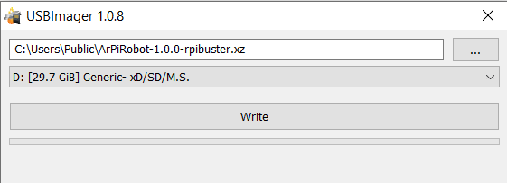

Before using the robot, you need to setup the Main Computer (often a Raspberry Pi) with the custom ArPiRobot OS image. 

For most supported devices this just entails downloading an OS image and flashing it to an SD card. OS images for supported boards can be found on the [downloads page](../../downloads/latest.md).

The ArPiRobot OS images are modified versions of operating system images for the board that include required software and proper configuration for use on an ArPiRobot robot.

## Requirements

Before starting you will need a computer (laptop or desktop used for development)&ast;, a [supported Main Computer](../hardware/supportedhardware.md), a power supply for the main computer (this can be the battery pack used to power the computer on the robot).

&ast;The software used in this section (balenaEtcher) is available for Windows, macOS, and Linux computers. If using another OS you will need to find another program to write the image file to the SD Card.

## Choosing an Image

It is always recommended to use the latest ArPiRobot image, available on the [downloads page](../../downloads/latest.md). Make sure to download the correct image for your main computer board. Also note that some images are distributed as multiple files (all parts must be downloaded).

## Flash the Image

*WARNING: Flashing an image to the SD card will erase the entire contents of the SD card!*

The image must be written to a micro SD Card. To do so, we will use [USBImager](https://bztsrc.gitlab.io/usbimager/). Download and run it.

Select the image file to write in the top box and select the SD card to write it to in the dropdown menu. Then click "Write" and wait for the process to finish.

When done, insert the SD Card in the your robot's main computer and power it on.  Wait for it to finish booting (about 30-60 seconds for most boards). The first boot will take longer than most as it will expand the root partition to fill the SD card then reboot.

Once the main computer boots it will be generating a WiFi network called "ArPiRobot-Robot" with a default password of "arpirobot123". This network is how we will interface with the robot later. When working with the robot, keep in mind that there will be no internet access via this network, it is just used to communicate with the robot. While connected to the Pi's network you can open the deploy tool and connect it to the robot (by clicking the connect button in the deploy tool). There is a network settings tab in the deploy tool where you can change the robot's WiFi SSID and password (useful if you want multiple robots running at once or if you want a non-default password).
