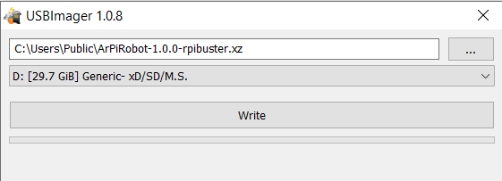

# ArPiRobot Framework

A collection of programs, libraries, and tools to make building robots easy and accessible.

1. **Easy for education use**

    ??? info "Details"
        This means that it not only needs to be easy to code with, but easy to **use** without assuming lots of experience with computers. Most existing solutions require knowledge of SSH, various types or wiring, writing code to communicate with different devices, creating a from-scratch wireless control solution, setting up a development environment from scratch or writing code with a command line editor. This may work well for many experienced developers, but it does not often for new developers and people who want to just get started quickly.

2. **Provide a complete setup from writing code to deploying it, to controlling the robot**

    ??? info "Details"
        The ArPiRobot project provides an easy to use development environment, pre-configured OS images for the robot, a GUI tool to deploy code from your PC to the robot, a GUI tool to control the robot wirelessly, scripts to manage everything from WiFi to launching the program on boot, and a program libraries to interface with many devices. Everything has been designed to make it easy to use and just get started making a robot work instead of spending time on communicating with motor controllers, WiFi, gamepads, bluetooth,  etc.

3. **Support low-power, low-cost devices**

    ??? info "Details"
        Not only does this make it more accessible (in line with the education use goal), but there's no reason you couldn't use it on a more powerful device. It just means that more power is left for demanding tasks such as camera streaming, vision processing, etc. The core functionality of the framework is designed to work even on the single-core Raspberry Pi Zero W and more advanced features are all designed for and tested on the Raspberry Pi 3A+.

## Overview

The ArPiRobot Framework include various components to make building a robot easy.

??? info "Drive Station"
    The drive station runs on your computer and makes it easy to communicate with a robot's program wireless to control the robot or send information to/from the robot.

    

??? info "Deploy Tool"
    The deploy tool runs on your computer and makes it easy to configure the robot and deploy your programs to the robot. No command line tools required.

    

??? info "Visual Studio Code Extension"
    The provided extension makes it easy to write robot programs using Visual Studio Code. Visual Studio code is a code editor / development environment which provides suggestions and error detection for Python and C++.

    

??? info "Operating System Images"
    Pre-configured Operating system images are provided for supported single board computers. All you have to do is write them to an SD card.

    

??? info "Core Library"
    Python and C++ library with support for many different devices to make writing robot code easy.

??? info "Arduino Firmware"
    Arduino program provided to make it easy to add additional sensors to the robot.

??? info "Other Tools"
    Additional tools, such as C++ cross compiler toolchains are provided to ensure ease of use.

??? info "Guide"
    A detailed step-by-step guide is provided to make setting everything up easy. Additionally, this guide includes some example low cost robot builds (also with step-by-step instructions).

    See the Guide [here](./guide/gettingstarted.md)

    

## Support

If you run into issues, need help, or have questions, post on the [ArPirobot Discussions Board](https://github.com/orgs/ArPiRobot/discussions).

## License

All components of the ArPiRobot Framework are open source and most are released under the [GNU Lesser General Public License v3.0](https://www.gnu.org/licenses/lgpl-3.0.html).

## Where Does the Name Come From?

I got tired of typing `ArduinoAndPiRobot` so I decided to shorten it into `ArPiRobot`. Really creative right?
