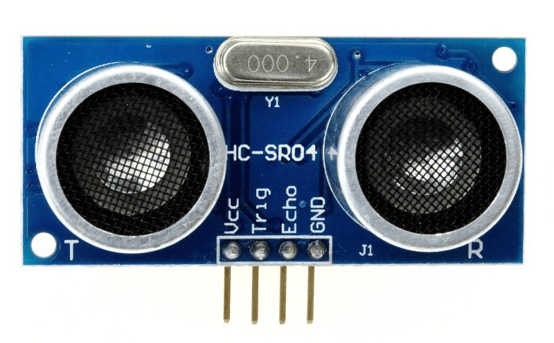
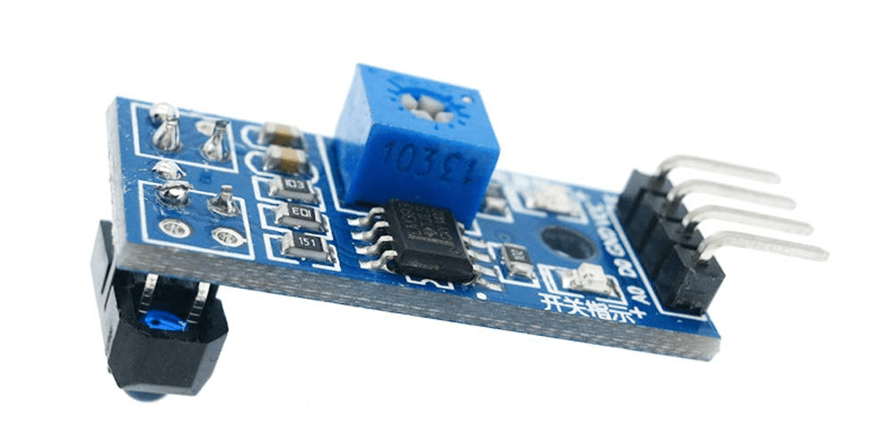

A "main computer" on the robot (a single board computer running a Linux based operating system) is not well suited to interface with many types of sensors. However, low cost Arduino and Arduino compatible microcontroller development boards are.

On ArPiRobot robots, an Arduino acts as a "coprocessor" that connects to and gets data from various sensors. It may also perform some calculations using the data. It then provides information from the sensors to the main computer of the robot.

This is done by using the ArPiRobot Arduino Firmware (see [downloads page](../downloads/latest.md)). The firmware supports several Arduino compatible development boards (see the repository on [GitHub](https://github.com/ArPiRobot/ArPiRobot-ArduinoFirmware#arpirobot-arduinofirmware) for a list).

## ArduinoInterface

An `ArduinoInterface` object is used to connect to an Arduino coprocessor from an ArPiRobot program. Currently, it is only possible to connect to an Arduino coprocessor via UART (typically over a USB cable). This uses the `ArduinoUartInterface` object.

### Creating a UART Interface Object

An `ArduinoUartInterface` object can be created as shown below. The device requires two pieces of information: a port name and a baud rate. The name of the port is in the form `/dev/tty[TYPE][NUM]`. `[TYPE]` is typically either `USB` or `ACM` depending on which arduino is used. `NUM` will typically be `0`, being the first UART device of that type. The baud rate is a "speed" that must be the same on both devices. Unless you modified the ArPiRobot Arduino Firmware running on the coprocessor, this will be `57600`.

=== "Python (`robot.py`)"
    ```py
    # Add with other imports
    from arpirobot.arduino.iface import ArduinoUartInterface

    # Add in __init__ of Robot class
    self.arduino = ArduinoUartInterface("/dev/ttyUSB0", 57600)
    ```

=== "C++ (`robot.hpp`)"
    ```cpp
    // Add with other includes
    #include <arpirobot/arduino/iface/ArduinoUartInterface.hpp>

    // Add with other member variables in Robot class
    ArduinoUartInterface arduino { "/dev/ttyUSB0", 57600 };
    ```

### Adding Devices to the Interface

Before the interface can be started, devices must be added to the interface. Various devices can be created and added to an interface (each is described in the "Arduino Devices" section below).

The ArPiRobot framework relies on the main computer to tell the Arduino coprocessor what is connected to it. This means the Arduino firmware will not need to be modified, only a robot program. However, it is necessary to tell an arduino what is connected to it (by adding devices) before "starting" the arduino. The process shown below can be repeated for multiple devices on the same arduino interface. In the example below `DeviceClass` is a placeholder and should be replaced with the name of an actual device (described in "Arduino Devices" section).

=== "Python (`robot.py`)"
    ```py
    # Add with imports
    from arpirobot.arduino.sensor import DeviceClass

    # Add in __init__
    self.device = DeviceClass(deice_arg1, device_arg2, ...)

    # Add in robot_started
    self.arduino.add_device(self.device)
    ```
=== "C++ (`robot.hpp`)"
    ```
    // Add with includes
    #include <arpirobot/arduino/sensor/DeviceClass.hpp>

    // Add as a member variable
    DeviceClass device { deviceArg1, deviceArg2, ... };
    ```
=== "C++ (`robot.cpp`)"
    ```cpp
    // Add in robotStarted
    arduino.addDevice(device);
    ```

### Starting the Interface

Once all devices have been added, the arduino interface must be "started". When "started" the Arduino coprocessor will begin acquiring sensor data and performing required calculations. Once started, the Arduino coprocessor no longer accept new devices (`add_device` / `addDevice` on the interface) will have no effect. As such, the following line should be added in `robot_started` / `robotStarted` **after** all devices are added.

=== "Python (`robot.py`)"
    ```py
    self.arduino.begin()
    ```
=== "C++ (`robot.cpp`)"
    ```cpp
    arduino.begin();
    ```

## Arduino Devices

The following section lists information on each supported sensors for an arduino coprocessor. Each of these devices can be added to an Arduino Interface as described in the above section.


### VoltageMonitor

{: style="height:75px"}

This sensor supports reading a voltage using an analog pin on the Arduino. Typically, a voltage divider is also used to measure higher inputs than the Arduino's board voltage. This is often used to measure the voltage of the battery powering motors.

Configuring this sensor requires the following information:

- `pin`: The analog pin on the Arduino that the voltage should be read on. This can either be an integer (0, 1, 2, etc) or it can be a string prefixed with "A" ("A0", "1", "A2", etc). The prefix is ignored (meaning 0 is the same as "A0", 1 is the same as "A1", etc).
- `vboard`: The "board voltage" of the Arduino coprocessor. This is either 3.3V or 5V. This can be measured with a voltmeter to get a more exact reading, or you can just enter either 3.3 or 5.0 depending on the board.
- `r1`: The value of the "top" resistor of the voltage divider (if any)
- `r2`: The value of the "bottom" resistor of the voltage divider (if any)

*Note that to use the `VoltageMonitor` device with no voltage divider (no `r1` or `r2`) you cannot set both to zero. `r2` cannot be zero. Instead, set `r1` to zero and `r2` to any non-zero positive number (eg one).*

=== "Python (`robot.py`)"
    ```py
    from arpirobot.arduino.sensor import VoltageMonitor
    ```
=== "C++ (`robot.cpp`)"
    ```cpp
    #include <arpirobot/arduino/sensor/VoltageMonitor.hpp>
    ```


### Ultrasonic4Pin

{: style="height:90px"}

This `ArduinoDevice` supports 4-pin ultrasonic rangefinder sensors. Note that 3-pin variants are not supported. The common 4-pin variants (eg HC-SR04) have a "trigger" and "echo" pin in addition to power and ground. Other devices with this type of pinout should be supported.

Configuring this sensor requires the following information:

- `trigger_pin`: What pin on the Arduino is connected to the sensor's trigger pin. This can either be a number (0, 1, 2, etc) for a digital pin or a string prefixed with "A" if connected to one of the analog input pins ("A0", "A1", etc). Note that the analog pin will be used in digital mode thus "A0" is not the same as 0.
- `echo_pin`: What pin on the Arduino is connected to the sensor's echo pin. This can either be a number (0, 1, 2, etc) for a digital pin or a string prefixed with "A" if connected to one of the analog input pins ("A0", "A1", etc). Note that the analog pin will be used in digital mode thus "A0" is not the same as 0. *It is highly recommended to use an interrupt enabled pin for the echo pin. Different Arduinos have different pins that support interrupts.*

=== "Python (`robot.py`)"
    ```py
    from arpirobot.arduino.sensor import Ultrasonic4Pin
    ```
=== "C++ (`robot.cpp`)"
    ```cpp
    #include <arpirobot/arduino/sensor/Ultrasonic4Pin.hpp>
    ```


### SingleEncoder

{: style="height:125px"}

This sensor supports any single channel digital encoder. A single channel encoder will have only one signal line. Such encoders are typically optical encoders (beam of light is interrupted by a slotted disk). This device supports measuring distance traveled and speed (without accounting for direction).

Configuring this sensor requires the following information:

- `pin`: The signal pin for the encoder. This can either be a number (0, 1, 2, etc) for a digital pin or a string prefixed with "A" if connected to one of the analog input pins ("A0", "A1", etc). Note that the analog pin will be used in digital mode thus "A0" is not the same as 0. *It is highly recommended to use an interrupt enabled pin for SingleEncoder devices. Different Arduinos have different interrupt enabled pins.*
- `use_internal_pullup`: Some single channel encoders require the signal line have a pullup resistor. For such devices, set this to true to use the pullup builtin to the Arduino for that pin. This must be connected to a pin supporting a pullup resistor to have any effect. On most Arduinos, all pins support pullup resistors.

=== "Python (`robot.py`)"
    ```py
    from arpirobot.arduino.sensor import SingleEncoder
    ```
=== "C++ (`robot.cpp`)"
    ```cpp
    #include <arpirobot/arduino/sensor/SingleEncoder.hpp>
    ```


### IRReflectorModule

{: style="height:80px"}

{: style="height:80px"}

Supports infrared reflection detector modules (typically used for line followers). These modules include an IR led and an IR detector (photoresistor, photodiode, or phototransistor). Typically these include a comparator and tuning potentiometer to generate a digital "detected" / "not detected" signal. Some also give direct access to an analog signal.

Configuring this sensor requires the following information:

- `digital_pin`: What pin the digital signal from the comparator is connected to. This is typically labeled "out" or "D0" on the modules. This can either be a number (0, 1, 2, etc) for a digital pin or a string prefixed with "A" if connected to one of the analog input pins ("A0", "A1", etc). Note that the analog pin will be used in digital mode thus "A0" is not the same as 0.
- `analog_pin`: What analog pin the analog signal from the sensor is connected to. This can either be an integer (0, 1, 2, etc) or it can be a string prefixed with "A" ("A0", "1", "A2", etc). The prefix is ignored (meaning 0 is the same as "A0", 1 is the same as "A1", etc).


### OldAdafruit9Dof

TODO


### NxpAdafruit9Dof

TODO


### Mpu6050Imu

TODO


### QuadEncoder

TODO


## Static Devices in Arduino Firmware

*Note: Most users will have no reason to use static devices. This is mostly useful for custom additions to the Arduino Firmware.*

In rare cases, it may be desirable to "statically" add devices in the Arduino Firmware itself (by modifying the firmware). A "static" device is one that is created in the Arduino Firmware and always exists. Such devices are assigned predetermined id numbers and are **not** created / configured by the robot program.

In such cases, it is necessary that a corresponding device is added to the `ArduinoInterface1` in the robot program with all the same configuration (arguments) as in the Arduino Firmware. However, the device must be added to the interface **without** creating a new device. Instead, the device must be given it's predetermined id number.

To do this, there are two optional arguments for each Arduino Device. These options are at the end (after all configuration arguments for the sensor). The first argument is set to false to indicate that the arduino interface should not attempt to create the sensor. The second argument is the predetermine id number of the sensor.

=== "Python"
    ```py
    # Attach to static device with id 1
    device = DeviceClass(device_arg1, device_arg2, ..., False, 1)
    ```
=== "C++"
    ```cpp
    // Attach to static device with id 1
    DeviceClass device { deviceArg1, deviceArg2, ..., false, 1 };
    ```

After this, the device can be added to the interface as usual with `add_device` / `addDevice`.
