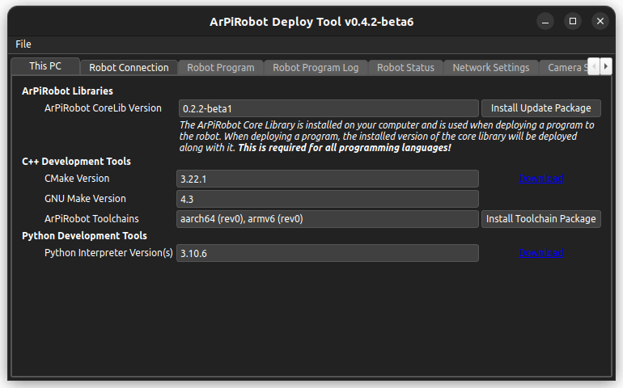
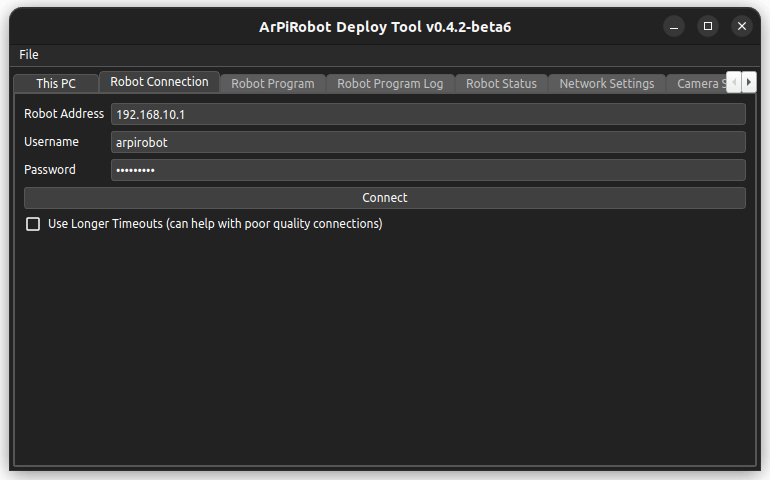
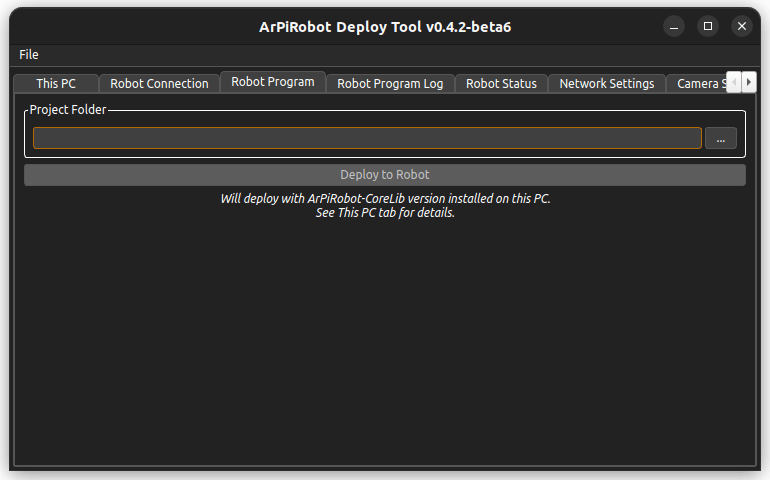
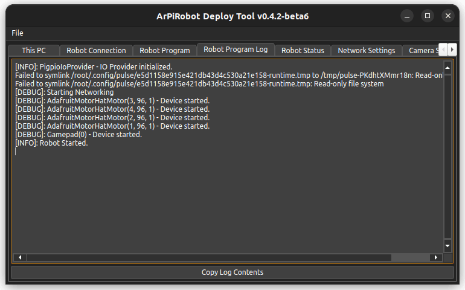
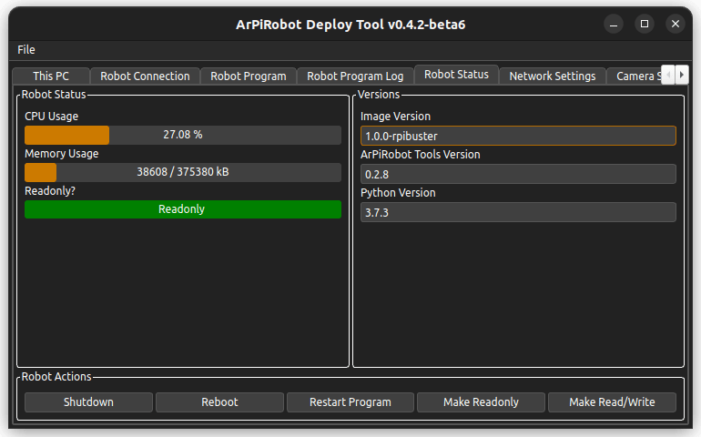
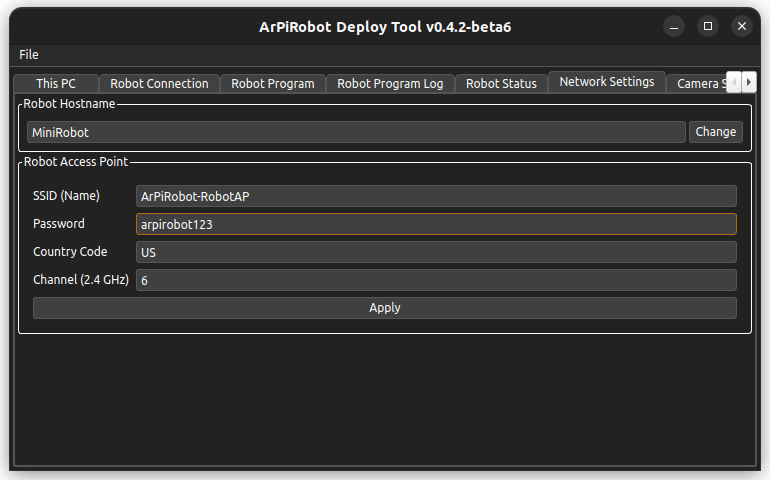
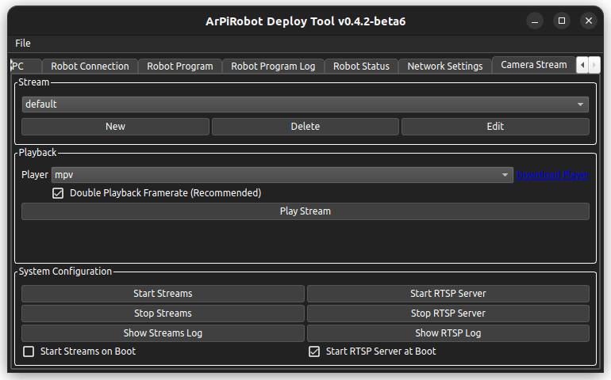

# Deploy Tool Manual

The Deploy Tool is a program that runs on your computer with the primary purpose of deploying a robot program written on your computer to the robot via the robot's WiFi network. It is also used to configure the robot's computer.

## Uses / Features
- Connect via SSH&ast; to the computer on the robot
- Show the CPU usage, memory usage, and writable status of the computer on the robot
- Show the image version, python version, ArPiRobot-Tools version, and PythonLib version in use on the robot
- Shutdown or reboot the robot, restart the running robot program, and switch between readonly and read/write states
- Deploy a program from your computer to the robot (such that the robot will run the program on boot)
- Configure the robot's computer's WiFi network settings (SSID, password, channel, country) and the hostname
- Send updates to and install updates on the robot
- Pull the full robot program log

&ast;This is a way of logging in to the computer over the network. Unlike the [Drive Station](./drive_station.md) which connects to a running robot program, the Deploy Tool connects to the robot's computer itself.

## Installing and Running
The Deploy Tool is built and available for download in the following formats

- `.exe` file - This is a windows installer that will install the Deploy Tool. Supports 64-bit x86 Windows (x86_64).
- `.app.zip` - This is a zip file containing a macOS app for the Deploy Tool After extracting the zip you can drag the `.app` file to your Mac's `Applications` folder so the Deploy Tool will show up in Launchpad. Supports 64-bit x86 macOS (x86_64).
- `.deb` file - This is a package that can be used to install the Deploy Tool on Ubuntu Linux (it should also work on other debian based systems using `.deb` packages). It depends on the required packages. Supports any architecture where PySide6 is available.
- `.tar.gz` file - This is a package for any linux distribution. Python3, pip, and venv must be installed from system packages. Then, extract the package and run `install.sh`. Supports any architecture where PySide6 is available. 

## This PC Tab

{: style="height:400px"}

The "This PC Tab" is used to view or install different tools required for ArPiRobot program development on your computer.

The "ArPiRobot Libraries" section is used to install libraries used to develop ArPiRobot programs. Currently, this is just the Core Library (ArPiRobot CoreLib). The version of the currently installed version will be displayed. Next to the version, the "Install Update Package" button can be used to select a downloaded CoreLib zip file to install a new version. This will be installed over any existing version (only one version of the CoreLib can be installed at a time).

Below this section, there are sections for both C++ and Python development tools. It will show the currently installed version (if any) and sometimes have download links. Additionally, for C++ development tools, there is a button to install ArPiRobot Toolchain packages. Multiple toolchains can be installed (only one per architecture).

## Connecting to the Robot (Connection Tab)

{: style="height:400px"}

Until you connect to the robot you will not be able to access most other tabs in the Deploy Tool.

Before connecting to the robot make sure your computer is connected to the Robot's WiFi network (the access point generated by the robot). Then make sure (in the Deploy Tool) that the robot's IP address, and login credentials are correct (the default settings are listed [here](../../defaultsettings.md)). The initial settings are the default ones. If you make any changes to these settings they will be saved and reloaded the next time you run the Deploy Tool.

Once you are sure the settings are correct click the connect button. The Deploy Tool will login to the robot's computer and the load information about what versions of different components are in use on the robot. Once this is done the "Connecting" progress dialog will close. If the connection fails you will see an error message dialog. After a successful connection the "Connect" button will become a "Disconnect" button, which can be clicked to disconnect from the robot.

If you experience issues with the Deploy Tool getting disconnected frequently you can check the "Use Longer Timeouts" box on the connection tab, however if you have this issue with the Deploy Tool it is likely that you will run into other network related issues when controlling the robot using the [Drive Station](./drive_station.md). You may want to consider changing the robot's WiFi network channel (described in the Network Settings section below) or following some of the [WiFi debugging steps](../../guide/other/wifidebug.md). 

## Robot Program Tab

{: style="height:400px"}

The robot program tab is used to deploy a robot program to the robot. First you must select the project folder. The project folder contains a file called `arpirobot-proj.json`. This file determines what files are copied to the robot when deployed.

Once the project folder is selected click the "Deploy to Robot" button. This will start by making the computer's SD card read/write. Then it will stop the old robot program (this will cause the [Drive Station](./drive_station.md) to be disconnected if it is connected at the time). Then, the Deploy Tool will copy the required files from the project folder to the robot along with the version of the CoreLib installed on the computer with the robot. The new robot program will then be started. Finally, if the computer was readonly when the Deploy Started, it will be made readonly once again.

Because the SD card is read/write during deploy, you should **not** unplug the computer while a robot program is being deployed.

## Robot Program Log Tab

{: style="height:400px"}

This tab in the Deploy Tool is used to display the *full* robot program log. This will show the *entire* log since the program first started, unlike the [Drive Station](./drive_station.md) which will only show the portion of the log from after it connected. This log will also show errors that occur when *starting* the robot program. It will contain any output from the robot while running the program and is useful for debugging robot program crashes or finding errors that prevent the program from starting.

The log is refreshed automatically once every second so you will have a hard time selecting and copying the text before the refresh happens (and unselects all text). Instead you can use the "Copy Log Contents" button to copy the text from the log.

## Robot Status Tab

{: style="height:400px"}

The robot status tab is divided into three sections. The section at the bottom labeled "Robot Actions" has five buttons that perform different actions on the robot's computer.

- Shutdown will power the robot's computer off (this is the safe way to turn the Pi off if it is read/write)
- Reboot will restart the robot's computer
- Restart Program will stop any running robot program then start it again.
- Make Readonly will make the computer's SD card readonly
- Make Read/Write will make the computer's SD card read/write

Above the "Robot Actions" section there are two other sections. On the left is the "Robot Status" section. This section will show you the robot's computer's CPU Usage, memory (RAM) usage, and the state of it's SD card's filesystem (readonly or read/write).

On the right side is a "Versions" panel. This shows three different versions

- Image Version - The name of the image in use on the robot
- ArPiRobot Tools Version - This is the version of the installed ArPiRobot Tools (installed via updates)
- Python Version - The full version number of the python interpreter installed on the robot (this is the version of python that will be used when running robot programs)

## Network Settings Tab

{: style="height:400px"}

The network settings tab is divided into two sections. First is the "Robot Hostname" section. In this section you can view and/or change the robot's hostname. This is just the name of the robot's computer on the network. There is generally no reason to change this as the computer will have a known IP address (`192.168.10.1`) on its own WiFi network, however you can edit the hostname then click the "Change & Reboot" button. This will change the hostname then reboot the computer so the change takes effect. This will cause the Deploy Tool to disconnect. After rebooting, you will also likely need to reconnect your computer to the robot's WiFi network before you can reconnect with the Deploy Tool. It may take the computer a couple of minutes to reboot.

The more frequently used section is the "Robot Access Point" section. In this section you can adjust settings for the WiFi network generated by the robot's computer. The SSID is the network's name. The password is a WPA-2 passphrase (between 8 and 64 characters) for the WiFi network (this is the network's password). The country code is a two letter indication of which country the robot is in use in. This is important as some WiFi channels are not allowed in some countries. By default this is set to "US". You can find a list of country codes [here](https://www.arubanetworks.com/techdocs/InstantWenger_Mobile/Advanced/Content/Instant%20User%20Guide%20-%20volumes/Country_Codes_List.htm). The final setting in this section is the WiFi channel. This is one of the 2.4GHz channels (numbered 1 to 14). In the United States only 1 to 11 are allowed. In most of the rest of the world 1 to 13 are allowed. *If you set a channel that is not allowed based on the country code set you will loose access to the robot's WiFi network.* The robot will not generate a WiFi network on a channel that is disallowed based on the country code. If you do this you will probably need to re-flash the SD card to recover the robot.

## Camera Stream Tab

{: style="height:400px"}

The camera stream tab is used to configure and play video streams from cameras connected to the robot's computer. 

The first section, "Stream", is used to configure different camera feeds. Configured camera streams will be shown in the dropdown. The three buttons below can be used to create new feed configurations, delete existing ones, or edit existing ones. The new / edit dialog has many options to configure each individual stream.

The second section, "Playback", is used to play a selected stream. The stream must first be selected in the dropdown in the "Stream" section. Then, a playback tool can be chosen in the dropdown labeled "Player". Currently three tools are supported (and must be installed separately). These are [mpv](https://mpv.io/), [ffplay](https://ffmpeg.org/), and [mplayer](http://www.mplayerhq.hu/design7/news.html). Mpv is generally recommended, however ffplay may be more compatible in some circumstances.  Once a player is selected, a stream can be opened (played) using the "Play Stream" button.

Finally, the "System Configuration" section is used to configure both the camera stream service and the rtsp server service. The camera stream service runs all configured streams when started. The rtsp server service starts an rtsp server (used by default to run camera streams). For each, there is a button to manually start or stop the service. Additionally, there is a checkbox to start the service on boot (it is recommended to start both on boot if using camera streams).

## About Menu
The Deploy Tool's about menu can be accessed by clicking `File > About`. This will open an about dialog with information about the Deploy Tool's license as well as information about the licenses of third party software used by the Deploy Tool. In addition, in the title of the dialog (as in the title of the main Deploy Tool window) you will see the version number of the Deploy Tool.
