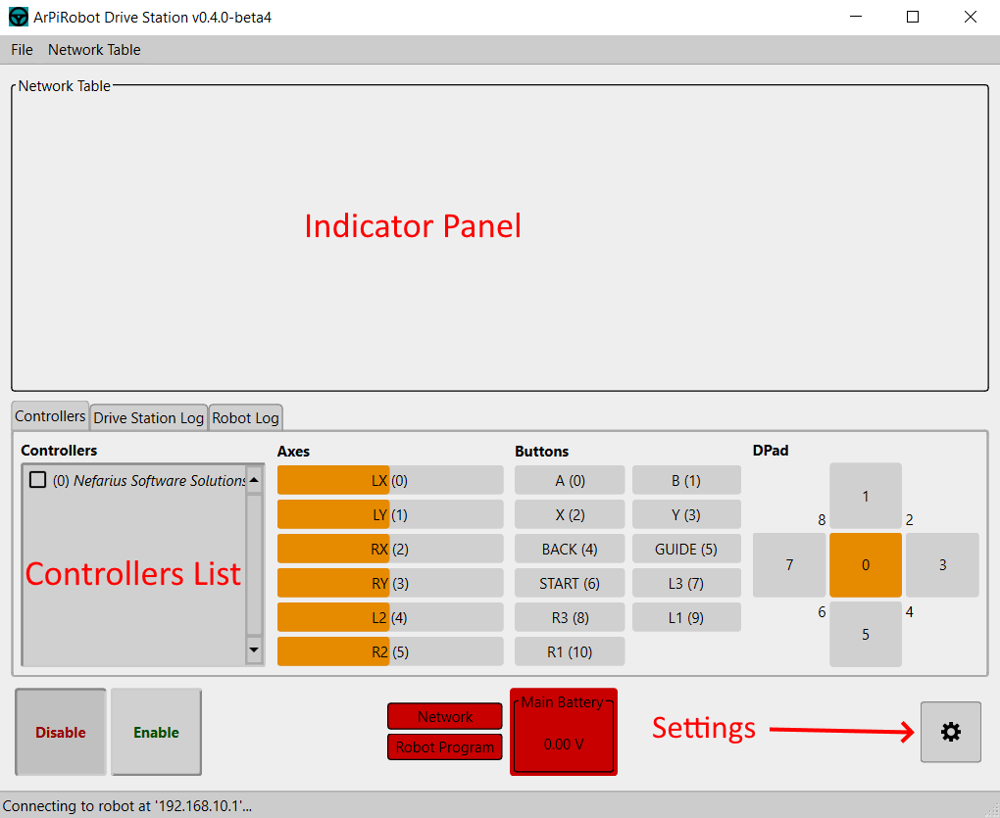

# Drive Station Manual

The ArPiRobot Drive Station is the program for your computer (Windows, macOS, Linux) that is used to control the robot. Its primary function is to enable/disable the robot and send data from a gamepad connected to your computer to the robot via WiFi.

{: style="height:400px"}

## Uses / Features
- Connect to a running robot program over the Raspberry Pi's WiFi network
- Enable and Disable the Robot
- Show the status (enabled / disabled) of the robot
- Show and test connected gamepads
- Use one or more gamepads to control the robot
- Show logs sent from the robot after connecting the Drive Station
- Show the value of NetworkTable key / value pairs form the robot
- Create or edit NetworkTable key / value pairs on the robot
- Save and load configurations of shown NetworkTable values and their sizes / positions on the screen

## Installing and Running

The Drive Station is built and available for download in the following formats

- `.exe` file - This is a windows installer that will install the Drive Station. Supports 64-bit x86 Windows (x86_64).
- `.app.zip` - This is a zip file containing a macOS app for the Drive Station. After extracting the zip you can drag the `.app` file to your Mac's `Applications` folder so the Drive Station will show up in Launchpad. Supports 64-bit x86 macOS (x86_64).
- `.deb` file - This is a package that can be used to install the Drive Station on Ubuntu Linux (it should also work on other debian based systems using `.deb` packages). It depends on the required packages. Supports any architecture where PySide6 is available.
- `.tar.gz` file - This is a package for any linux distribution. Python3, pip, and venv must be installed from system packages. Then, extract the package and run `install.sh`. Supports any architecture where PySide6 is available. 

## Connecting to the Robot
Before attempting to connect to the robot you will need to make sure your computer is connected to the WiFi network created by the robot. It may also be necessary to disconnect from other networks (such as ethernet).

Once your computer is connected to the robot's WiFi the drive station will automatically connect. When this occurs the "Network" indicator will become green. If there is a program running on the robot, the "Robot Program" indicator will turn green too (indicating the drive station is fully connected). However, if no program is running one must be started before the drive station will fully connect (the drive station connects to the program running on the robot, not to the robot itself).

Only one Drive Station can be connected to the robot at a time.

If you are not using the robot's WiFi network or have modified the network configuration on the robot such that the robot has a non-default IP address you can change the IP address used when connecting to the robot in the Drive Station's settings (settings icon in bottom right). Hostnames can also be used and will be resolved using DNS.

## Enabling and Disabling the Robot
In the bottom left corner of the drive station window, there are two buttons: one labeled "Disable" and another labeled "Enable". These disable and enable the robot respectively.

The robot's current state will be indicated by "lowering" one of these buttons. The lowered button matches the state of the robot (ie if the "Disable" button is lowered the robot is currently disabled).

## Selecting and Using Gamepads
When the "Controllers" tab in the bottom half of the Drive Station is selected you will see on the left side of the screen a section labeled "Controllers". Any gamepads connected to your PC will be listed in this section with their name beside a checkbox. 

You can drag the gamepads in the list to reorder them. The topmost gamepad will be gamepad 0. The next one will be gamepad 1, then gamepad 2, and so on. Each gamepad's number is indicated before it's name in parenthesis.

To "enable" a gamepad so that the drive station sends data from it to the robot it is connected to you will need to check the checkbox beside the gamepad's name. The Drive Station will send the data from each checked gamepad to the robot. Uncheck any gamepad to stop sending its data to the robot. Whether or not gamepads are checked does not change the number order of the gamepads. For example, if the top gamepad is unchecked, but the next one is checked the checked gamepad will still be gamepad number 1 and the robot will not receive data from gamepad 0 (even though it does receive data for gamepad 1).

If a gamepad is disconnected from the computer the Drive Station will remove it from the list. This can change the number of other controllers. As such, the drive station automatically disables the robot when this occurs.

Beside the gamepad list there are a set of indicators that show the values of the axes, buttons, and dpad of the selected gamepad. To "select" a gamepad and see it's controls values in this section click on its name in the controller list. It will have a different background color to indicate that it is the selected controller. While selected, any action performed with the gamepad will be shown by the axis, button, or dpad indicators.

## Reading Logs
There are two logs visible from the Drive Station: the robot log and the drive station log. The Drive Station log will show errors, warnings, and other messages from the Drive Station, while the robot log will show messages received from the robot (this only displays messages from the robot *after* the drive station connects).

There are four log levels. The lower the level the more detailed the information that will be shown. Both the robot and drive station logs have these same levels.

1. Debug
2. Info
3. Warning
4. Error

All four levels of log messages will be shown in the drive station log windows.

## Main Battery Voltage
If a voltage monitor device is designated as the main voltage monitor on the robot, the Drive Station will display the voltage as determined by the sensor in the lower center of the Drive Station window. The battery voltage indicator will change color based on the percentage range of the voltage read compared to the nominal (as printed on label) battery voltage. The main battery voltage can be set in the Drive Station settings. This voltage should be the nominal voltage of the batteries in use. For example, with 5 AA batteries at 1.5V each the "Main Battery Voltage" should be 5 * 1.5 = 7.5. Most batteries exceed this value when fully charged or new (in the case of non-rechargeable batteries).

The colors of the indicator by percentage level are as follows

- 100% and above = Green
- 85%-99% = Yellow
- 70%-84% = Orange
- 70% and below = Red

Keep in mind that it is normal for the battery voltage to drop significantly when motor first start moving.

## NetworkTable Indicators
An indicator shows the value of a key / value pair from the Network Table. You can add indicators in two ways:

- By creating a new indicator (and if it does not exist a corresponding key / value pair in the Network Table)
- By adding an indicator for existing key / value pairs received from the robot or already known to the drive station

The top portion of the drive station is the indicators panel. In this boxed in area any indicators you add are shown and can be resized and moved around any way you want.

To create a new indicator click `Network Table > Add New`. Then enter a key name in the dialog and click OK. You can only have one indicator for any key / value pair.

To add an indicator for an existing key / value pair select an existing key under `Network Table > Add From Robot`. This menu will display any keys that the robot program has previously written.

Once an indicator is on the panel it can be deleted (removed from the panel, but not the Network Table) by right clicking it and choosing delete. Additionally, all indicators can be removed from the indicators panel by using the `Network Table > Clear Indicators` option. 

You can also edit the value of an indicator (and change the corresponding value on the Network Table) by right clicking and making the indicator editable. You will then be able to type values in the text field next to the indicator's label. Uncheck "Editable" in the right click menu to disable editing an indicator. Setting the value of an indicator is an easy way to send small amounts of information to the robot.

To resize an indicator click the label. The drag the left or right edges of the box drawn around it to resize the indicator. To move the indicator, click and drag the indicator's label.

Be aware that positions in the indicators panel are "absolute" meaning if you resize the Drive Station window it is possible to move an indicator off the screen. For this reason it is recommended to keep the Drive Station the same size at all times. The two easy ways to do this are to use the default size or to always maximize the window.

Finally, note that the displayed indicators (including positions and sizes) are saved when the drive station is closed and restored the next time it is opened.

## About Menu
Can be accessed by clicking `File > About`. An about dialog will open up with information about the license of the Drive Station and the other software it makes use of.

## Drive Station Themes
The drive station supports two themes: a light theme and a dark theme. The theme can be selected in the settings dialog. Additionally, there is an option to increase font sizes when using either theme.
